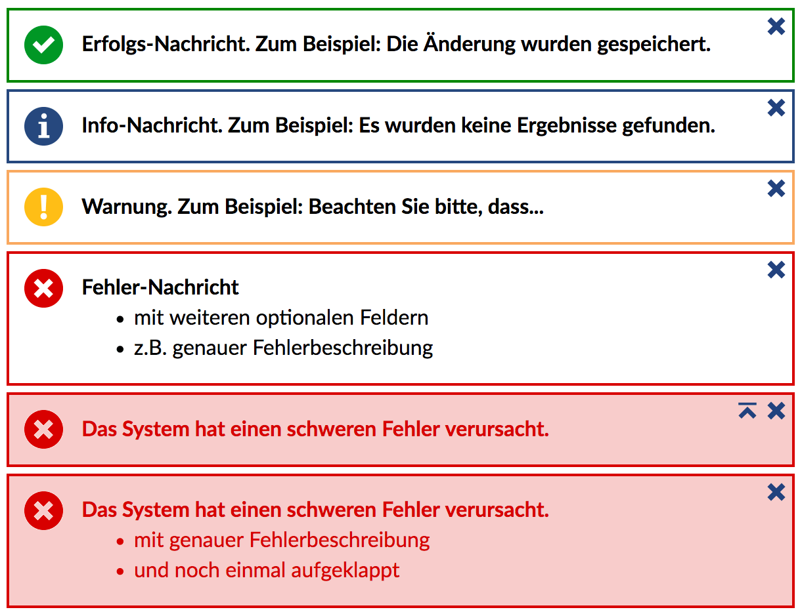

Die Messageboxen werden verwendet, um in Stud.IP Statusmeldungen jeglicher Art anzuzeigen. 

Die folgenden fünf Typen der Messagebox gibt es:

| Parameter | Beschreibung |
| ---- | ---- |
| **exception** | Nur für Systemfehler. Wird von unhandledExceptions benutzt. |
| **error** | Für Fehlermeldungen jeder anderen Art. Fehlende Benutzerrechte, falsche Eingaben etc. |
| **warning** | Für sämtliche Dinge, die keine echten Fehler sind aber auch nicht einfach als Information/Hinweis abgetan werden sollten. |
| **info** | Für allgemeine Hinweise, keine Ergebnisse bei Suchabfragen |
| **success** | Für Erfolgsbestätigungen. Speicherung, Änderung usw. |

### Parameter
Es können mindestens 1 bis maximal 3 Parameter übergeben werden. Diese haben folgende Bedeutung:

| Parameter | Beschreibung |
| ---- | ---- |
| `$message` | Die Hauptnachricht, die in der MessageBox angezeigt werden soll. |
| `[$details]` | Der 2. Parameter ist optional für zusätzliche Informationen. Diese müssen als Array übergeben werden. |
| `[$closed]` | Wenn dieser optionalen Parameter `true` übergeben wird, werden die  zusätzlichen Details zugeklappt angezeigt. |

### Messagebox auf der Folgeseite anzeigen

Im Regelfall möchte man die Statusmeldung nicht auf der aktuellen Seite, 
sondern auf der folgenden Seite anzeigen. 

Dafür gibt es die Methode `PageLayout::postMessage()`, der eine MessageBox übergeben wird.

Der Einfachheit halber gibt es für alle Typen der MessageBox eine passende `post<type>`-Methode der Klasse [`PageLayout`](PageLayout), wie beispielsweise `PageLayout::postSuccess()` oder `PageLayout::postError()`. 

Die Parameter der Methoden sind analog zu den oben beschriebenen Parametern der Methoden der Klasse `MessageBox`.


### Funktionshinweise
```php
// Beispiel für eine einfache Info-Nachricht
echo MessageBox::info('Nachricht');

// Beispiel für eine Error-Nachricht mit zusätzlichen Details
echo MessageBox::error('Nachricht', ['optional details', 'more details']);

// Beispiel für eine Success-Nachricht mit zusätzlichen Details, die jedoch zugeklappt sind.
echo MessageBox::success('Nachricht', ['optional details'], true);

// Beispiel für eine Success-Nachricht auf der folgenden Seite
PageLayout::postSuccess('Folgende Nutzer wurden angelegt', [
    'Max Mustermann',
    'John Doe',
]);
```


### Screenshots


