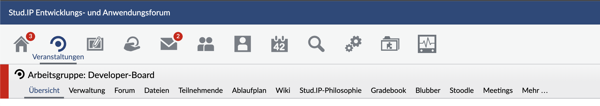

Die Navigations-API dient zur Manipulation der globalen Navigationsstruktur in Stud.IP. Damit sollen dynamische Änderungen an der Navigation leichter möglich und gleichzeitig der Pflegeaufwand der zentralen Dateien reduziert werden. Der Begriff "Navigation" umfaßt dabei nicht nur die Reiternavigation, sondern unter anderem auch die Icons in der Kopfzeile -- im folgenden "Top-Navigation" genannt -- und die Links auf der persönlichen Startseite, sowie ggf. in der Info-Box vorhandene Navigationspunkte (sofern es dort welche gibt).

### Allgemeines

Die gesamte Navigation wird von der Klasse `Navigation` in Stud.IP verwaltet, d.h. Navigationspunkte werden generell als Objekte erzeugt. Jeder Navigationspunkt kann beliebig viele Unterpunkte besitzen, so daß die Menge aller Navigationspunkte zusammen einen Baum bildet (zumindest solange ein Punkt nur an einer Stelle in der Navigation eingehängt wird). Einzelne Navigationspunkte können über ihren Pfad im Baum angesprochen werden. Jedem Navigationobjekt kann ein Bild zugewiesen werden, allerdings werden derzeit nur für die Punkte der Top-Navigation diese auch angezeigt. Navigationspunkte, die keine URL besitzen, werden automatisch ausgeblendet. Das gleiche gilt für Punkte der Top-Navigation, die kein Bild gesetzt haben.

Besitzt ein Navigationspunkt, der weitere Unterpunkte hat, keine eigene URL, so wird automatisch die URL des ersten Unterpunkts verwendet, der eine URL gesetzt hat. Das ist besonders dann praktisch, wenn der erste Punkt der Subnavigation je nach Rechtestufe manchmal nicht angezeigt wird. So verweist der übergeordnete Reiter immer automatisch auf den ersten sichtbaren Reiter der Subnavigation. Enthält die Subnavigation keine (sichtbaren) Elemente, wird der übergeordnete Reiter dann ebenfalls automatisch ausgeblendet.

### Erzeugung eines Navigationspunktes

Für die Erzeugung und Konfiguration eines Navigationsobjekts gibt es im wesentlichen vier Operationen:

```php
__construct($title, $url = NULL, $params = NULL)
```
Erzeugt einen Navigationspunkt und setzt Titel und (optional) URL und ggf. URL-Parameter.

```php
setTitle($title)
```

Setzt den Titel des Navigationsobjektes. Ob dieser angezeigt wird ist abhängig vom Platzierungsort des Navigationsobjektes.

```php
setURL($url, $params = NULL)
```

Setzt den Titel bzw. die URL. Weitere URL-Parameter können wie beim `URLHelper` als Array von Schlüssel/Wert-Paaren übergeben werden.

```php
setImage($image, $options = [])
```
Setzt ein Bild für den Navigationspunkt, entweder über den Pfad zu einer Bilddatei (z.B. in einem Plugin) oder über einen Bildnamen aus dem Assets-Bereich (der Normalfall im Kernsystem). Zusätzliche Attribute für den `img`-Tag können ebenfalls übergeben werden (*title*, *style* o.ä.). Die gesetzten Bilder werden auch in der jeweiligen Reiternavigation in Veranstaltungen und Instituten angezeigt.

```php
setActiveImage($image, $options = [])
```

Setzt ein Bild für den aktiven Zustand des Navigationspunkts, entweder über den Pfad zu einer Bilddatei oder über einen Bildnamen aus dem Assets-Bereich. Gibt es kein separates Bild für den aktiven Zustand, wird das normale Bild verwendet. Zusätzliche Attribute für den `img`-Tag können ebenfalls übergeben werden (*title*, *style* o.ä.). Die gesetzten Bilder auch in der jeweiligen Reiternavigation in Veranstaltungen und Instituten angezeigt.

Ein kleines Beispiel:

```php
$navigation = new Navigation('Admin');

$navigation->setURL('adminarea_start.php');
$navigation->setImage(
    'header_admin',
    ['title' => 'Zu Ihrer Administrationsseite')];
```

Beispiel für Bilder in der Reiternavigation


### Einhängen eines Navigationspunktes im Plugin

Benötigt ein Plugin einen Navigationspunkt, so wird dieser im Konstruktor des Plugins erzeugt und hinzugefügt. Die folgenden drei Codezeilen fügen bei einem SystemPlugin ein Navigationselement auf der Startseite hinzu:

```php
$navigation = new Navigation(dgettext('PluginName', 'Ein Plugin-Name'));

$navigation->setURL(PluginEngine::getURL($this, [], 'controller/index'));

Navigation::addItem('/start/pluginname', $navigation);
```

Unter der Annahme, das der Name des Plugins PluginName ist, würde das obige Beispiel auf der Startseite ein Navigationsobjekt erzeugen, welches auf den Pfad /public/plugins.php/pluginname/controller/index verweist.

Die erste Zeile erzeugt ein Navigationsobjekt und gibt diesem einen Namen. Um eine einfache Übersetzung zu ermöglichen, wird mittels dgettext der Name übersetzbar gemacht. Danach wird die URL gesetzt, unter Zuhilfenahme der Funktion getURL der PluginEngine-Klasse. Diese benötigt zuerst die Plugin-Instanz, danach ein Array mit Parametern für die URL und zuletzt der Pfad unterhalb von plugins.php, auf welchen verwiesen werden soll. In der dritten Zeile wird nun zur Navigation der Startseite ein neuer Eintrag anhand des neuen Navigationsobjektes hinzugefügt. Der Pfad /start/pluginname gibt hierbei keine URL an, sondern benennt den neuen Eintrag in der Navigation lediglich mit einem eindeutigen Namen. Das Navigationsobjekt selbst sorgt für den passenden URL-Pfad.

### Einhängen eines Navigationspunktes in einem Stud.IP Controller

Neue Navigationspunkte, welche auf einen Stud.IP Controller verweisen, werden direkt in die Navigations-Klassen, welche den Navigationsbaum wiederspiegeln, geschrieben. Dazu existieren im Stud.IP Hauptverzeichnis im Unterordner /lib/navigation/ verschiedene Klassen für unterschiedliche Bereiche der Navigation, welche alle von Navigation.php abgeleitet sind. Die vergebenen Klassennamen entsprechen den Pfaden der ersten Navigationsebene.


Das Einhängen in die vorhandene Navigationsstruktur erfolgt wahlweise entweder über die statische Methode `Navigation::addItem($path, $navigation)` oder über die Methode `addSubNavigation($name, $navigation)` des übergeordneten Navigationsobjekts. Entsprechend gibt es auch die Methode `Navigation::removeItem($path)` bzw. `removeSubNavigation($name)`, um einen Eintrag wieder zu entfernen. Die Methode `Navigation::insertItem($path, $navigation, $where)` fügt einen Eintrag an einer bestimmten Position in die vorhandene Navigation ein.

Um zum Beispiel zu einer Veranstaltung einen neuen Reiter "Demo" mit zwei Unterpunkten "Test 1" und "Test 2" hinzuzufügen, würde man zunächst die entsprechenden Navigationsobjekte erzeugen:

```php
$demonav  = new Navigation('Demo', 'dispatch.php/demo/index');
// URL: dispatch.php/demo/index?test=1
$test1nav = new Navigation('Test 1', 'dispatch.php/demo/index', array('test' => 1));
// URL: dispatch.php/demo/index?test=2
$test2nav = new Navigation('Test 2', 'dispatch.php/demo/index', array('test' => 2));   
```

Im Anschluss werden diese in die globale Navigationsstruktur eingehangen:

```php
Navigation::addItem('/course/demo', $demonav);
$demonav->addSubNavigation('test1', $test1nav);
$demonav->addSubNavigation('test2', $test2nav);
```

Alternativ kann das Einhängen auch folgendermaßen funktionieren:

```php
Navigation::addItem('/course/demo', $demonav);
Navigation::addItem('/course/demo/test1', $test1nav);
Navigation::addItem('/course/demo/test2', $test2nav);
```

Zum Entfernen eines Links wird removeItem wie folgt verwendet. Im Beispiel wird der Link "Meine Veranstaltungen" von der Startseite entfernt:

```php
Navigation::removeItem('/start/my_courses');
```

Das folgende Beispiel leitet den Punkt "Hochladen des persönlichen Bildes" der Homepage auf eine eigene Seite in einem Plugin um:

```php
$navigation = Navigation::getItem('/homepage/bild');
$navigation->setURL(PluginEngine::getURL($plugin));
```

#### Aktivierung der Navigation

Der auf der jeweils aktuellen Stud.IP-Seite "aktive" Navigationspunkt muss markiert werden, damit die korrekte Reiternavigation ausgewählt und dieser Punkt dort entsprechend hervorgehoben werden kann. Die "alte" Methode, die globale Variable `$reiter_view` zu setzen, funktioniert nun nicht mehr. Stattdessen muss man einen Navigationspunkt explizit aktivieren:

```php
Navigation::activateItem('/course/demo/test1');
```

Alternativ kann man auch statt der Klasse `Navigation` die Klasse `AutoNavigation` verwenden, die einen Navigationspunkt *automatisch* als aktiviert meldet, wenn die URL der aktuellen Seite der URL der Navigation entspricht und alle im Navigationsobjekt gesetzten URL-Parameter auch im aktuellen Request vorhanden sind und dort den gleichen Wert haben. Im oben beschriebenen Beispiel sähe das dann so aus:

```php
$demonav  = new Navigation('Demo', 'demo.php');
$test1nav = new AutoNavigation('Test 1', 'demo.php', array('test' => 1));
$test2nav = new AutoNavigation('Test 2', 'demo.php', array('test' => 2));

[...]
```

### Globale Navigationsstruktur

Die globale Struktur der Navigation sieht derzeit  so aus:

* **/**				[-Wurzelknoten der Navigation-]
  * **start**		[-persönliche Startseite-] (`StartNavigation`)
  * **my_courses**  [-meine Veranstaltungen-]
  * ...			...
    * **browse**		[-Veranstaltungen und Einrichtungen-] (`BrowseNavigation`)
    * **my_courses**  [-meine Veranstaltungen-]
    * **courses**     [-Veranstaltungen Suchen / Hinzufügen-]
    * ...           ...
      * **course**		[-gewählte Veranstaltung / Einrichtung-] (`CourseNavigation`)
      * **main**          [-Übersicht-]
        * **details**      [-Kurzinfo-]
        * **admin**        [-Administration der Veranstaltung (nur für Dozenten und aufwärts)-]
        * **leave**        [-Austragen aus der Veranstaltung (nur für Autoren)-]
      * **admin**         [-Verwaltung (nur für Dozenten und Tutoren)-]
        * **details**      [-Grunddaten-]
        * **study_areas**  [-Studienbereiche-]
        * **dates**        [-Zeiten/Räume-]
        * **admission**    [-Zugangsberechtigungen-]
        * **aux_data**     [-Zusatzangaben-]
        * **copy**         [-Veranstaltung kopieren-]
        * **archive**      [-Veranstaltung archivieren-]
        * **visibility**   [-Sichtbarkeit ändern-]
        * **news**         [-Nachrichten einstellen-]
        * **vote**         [-Umfragen & Tests verwalten-]
        * **evaluation**   [-Evaluationen-]
      * **forum**         [-Forum-]
        * **view**         [-Themenansicht-]
        * **unread**       [-Neue Beiträge-]
        * **recent**       [-Letzte Beiträge-]
        * **search**       [-Suchen-]
        * ***create_topic*** [-Neues Thema anlegen (nur für Tutor und Dozent)-]
      * **members**       [-TeilnehmerInnen (nur in Veranstaltungen)-]
        * **view**         [-TeilnehmerInnen-]
        * **aux_data**     [-Zusatzangaben (nicht immer aktiviert)-]
        * **view_groups**  [-Funktionen / Gruppen-]
        * ***edit_groups*** [-Funktionen / Gruppen verwalten (nur für Tutor und Dozent)-]
      * **faculty**       [-Personal (nur in Einrichtungen)-]
        * **view**         [-MitarbeiterInnen-]
        * ***edit_groups*** [-Funktionen / Gruppen verwalten (nur für Tutor und Dozent)-]
      * **files**         [-Dateibereich-]
        * **tree**         [-Baumstruktur-]
        * **all**          [-Alle Dateien-]
        * **schedule**      [-Ablaufplan-]
        * **all**          [-Alle Termine-]
        * **type1**        [-Sitzungstermine-]
        * **other**        [-Andere Termine-]
        * ***topics***     [-Ablaufplan bearbeiten (nur für Tutor und Dozent)-]
      * **scm**           [-Freie Informationen (einstellbarer Tabname)-]
        * ...                [-eine beliebige Anzahl an Tabs mit MD5_id als Pfadnamen-]
      * **literatur**     [-Literatur-]
        * **view**         [-Literatur-]
        * **print**        [-Druckansicht-]
        * ***edit***     [-Literatur bearbeiten (nur für Tutor und Dozent)-]
      * **wiki**          [-Wiki-]
        * **show**         [-WikiWikiWeb-]
        * **listnew**      [-Neue Seiten-]
        * **listall**      [-Alle Seiten-]
        * **export**       [-Export-]
      * **resources**     [-Ressourcen-]
        * **overview**     [-Übersicht-]
        * **group_schedule** [-Übersicht Belegung-]
        * **view_details** [-Details-]
        * **view_schedule** [-Belegung-]
        * **edit_assign**  [-Belegung bearbeiten-]
      * ...                 [-... Plugins und eLearning-Module-]
    * **messaging**	[-systeminterne Nachrichten-] (`MessagingNavigation`)
      * ...         ...
    * **community**    [-Wer ist Online-] (`CommunityNavigation`)
      * **adress_book** [-Adressbuch-]
      * **chat**        [-Chat-]
      * **studygroups** [-Studiengruppen-]
      * **score**       [-Rangliste-]
    * **profile**      [-Profilseite-] (`ProfileNavigation`)
      * **view**        [-persönliche Homepage-]
      * **avatar**      [-Hochladen des persönlichen Bildes-]
      * ...         ...
    * **calendar**     [-Termine und Stundenplan-](`CalendarNavigation`)
      * **calendar**	[-Terminkalender-]
      * **schedule**	[-Stundenplan-]
    * **search**       [-Die neue Suchseite-] (`SearchNavigation`)
      * **courses**
      * **archiv**
      * **studygroups**
      * **persons**
      * **institutes**
      * **literature**
      * **resources**
    * **tools**        [-Die neue Werkzeugseite-] (`ToolsNavigation`)
      * **news**
      * **votes**
      * **literature**
      * **elearning**
    * **admin**        [-Administrationsbereich-] (`AdminNavigation`)
      * **course**      [-Veranstaltungen-]
      * **config**      [-globale Einstellungen-]
      * ...         ...
    * **links**        [-Link-Liste oben rechts-]
      * **account**     [-Kontoeinstellungen des Benutzers-]
      * **search**      [-Suche-]
      * **logout**      [-Logout-]
      * ...         ...
    * **login**        [-Menü auf der Login-Seite-] (`LoginNavigation`)
      * **login**       [-Login-]
      * **register**    [-Registrieren-]
      * ...           ...
    * **footer**        [-Fußzeile-] (`FooterNavigation`)
      * **help**       [-Login-]
      * **sitemap**    [-Sitemap-]
      * **stud.ip**    [-Stud.IP Webseite-]
      * **blog**       [-Blog-]
      * **impressum**    [-Impressum-]

Anmerkung: Die Punkte "course", "links" und "login" besitzen kein Symbol in der Top-Navigation.
