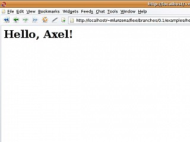
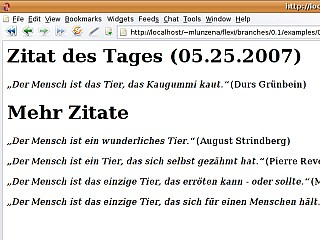
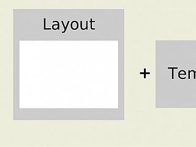

## Allgemeines

Templates liegen entweder im Ordner `/templates` oder unter `/app/views`. In ersterem sind Templates für die Seitenleite und generell verwendete Templates abgelegt, in letzterem hingegen Templates, die von Trails-Controllern automatisch für bestimmte Aktionen geladen werden, sofern nicht manuell andere Templates ausgewählt werden.

Stud.IP-Templates sind im allgemeinen HTML-Dateien, die mit PHP-Codeschnipseln angereichert sind, um bestimmte Dinge, die z.B. in einem Trails-Controller geladen wurden, auszugeben.

### PHP-Code in Templates

PHP-Code wird mit kurzen "Tags" eingeleitet. Statt `<?php` wird einfach `<?` geschrieben. Soll an der Stelle, an der der PHP-Code steht, eine Ausgabe erfolgen, so ist der öffnende Tag `<?=`. Die längere Schreibweise `<? echo $VARIABLE` sollte nicht verwendet werden.

Ein PHP-Codefragment schließt mit `?>`. 


### Tabellen

#### Stud.IP-Design

Damit Tabellen im Stud.IP-Design erscheinen, müssen sie die Klasse `default` besitzen. Dadurch werden verschiedene Hervorhebungen automatisch zur Tabelle hinzugefügt.

#### Tablesorter

Um eine Tabelle clientseitig sortierbar zu machen, kann das jQuery-Plugin Tablesorter eingebunden werden. Für die Einbindung muss kein eigener JavaScript-Code geschrieben werden. Es genügt, die Klasse `sortable-table` dem `<table>`-Element hinzuzufügen und den Kopfspalten (`<th>`-Elemente) das Attribut `data-sort` hinzuzufügen, welches angibt, wie die Spalten zu sortieren sind.

Die folgenden Sortiermethoden für Spalten sind in Stud.IP gebräuchlich:

* `digit`: Sortierung nach Zahlenwert
* `text`: alphabetische Sortierung
* `time`: Sortierung nach Uhrzeit
* `htmldata`: Sortierung nach der Angabe im Attribut `data-sort-value` an der jeweiligen Zelle

Weitere Sortiermethoden sind in der Tablesorter-Dokumentation zu finden:

https://mottie.github.io/tablesorter/docs/example-option-built-in-parsers.html

Um eine Standard-Sortierung festzulegen, wird dem table-Element das Attribut `data-sortlist` hinzugefügt. Dieses besteht aus einem zweidimensionalen Array, wobei die zweite Dimension aus zwei Werten besteht: Die Spaltennummer (beginnend bei 0) und die Sortierung (0 = aufsteigend, 1 = absteigend).

Beispiel: Hat man eine Tabelle mit 3 Spalten und möchte, dass die zweite Spalte standardmäßig absteigend sortiert werden soll, so setzt man `data-sortlist` auf den Wert `[[1, 1]]`. Soll die zweite Spalte hingegen aufsteigend sortiert werden, ist der Wert für `data-sortlist` `[[1, 0]]`.


## Flexi-Templates

### Beispiel 1: "Hello World"

Wie es sich gehört, kommt als erstes Beispiel das bekannte "Hello world". Dafür brauchen wir zwei Sachen:


* eine Template-Datei, die wie ein Lückentext funktioniert,
* ein PHP-Skript, das diesen Lückentext füllt und ausgibt.

Die Template-Datei liegt aus Hygienegründen in einem eigenen Verzeichnis `templates`. Damit sieht dann das Beispiel so aus:

index.php
templates/hello_world.php

Der Lückentext ist in der Datei `templates/hello_world.php` gespeichert. Die Flexi_Template-Engine benutzt die Endung einer Template-Datei, um die Art dieser zu erkennen. Eine Endung ".php" weißt dabei auf ein `Flexi_PhpTemplate` hin. Diese Art von Template ist einfach ein plain vanilla PHP-Skript. Wie sieht also unser Template aus?

```php
<h1>Hello, <?= $name ?>!</h1>
```

Offenbar wird der Platzhalter `$name` verwendet, um den Namen des Gegrüßten anzuzeigen.

Wie füllt man also dann diesen Lückentext? Schauen wir uns doch die Datei `index.php` an:

```php
<?php

# load flexi lib
require_once dirname(__FILE__) . '/../../vendor/flexi/flexi.php';

# where are the templates
$path_to_the_templates = dirname(__FILE__) . '/templates';

# we need a template factory
$factory = new Flexi_TemplateFactory($path_to_the_templates);

# open template
$template = $factory->open('hello_world');

# set name of the greetee
$template->set_attribute('name', 'Axel');

# render template
echo $template->render();
```

Zunächst wird offenbar die Flexi-Bibliothek geladen, daraufhin eine Variable mit dem Pfad zum Verzeichnis, wo unser Template liegt, gefüllt und dann mit dieser eine `Flexi_TemplateFactory` erzeugt.

Wie der Name schon andeutet, wird diese factory dazu benutzt, Templates herzustellen. Und genau das passiert als nächstes. Indem man der factory die Nachricht #open schickt, erhält man ein Template-Objekt. Dazu muss man als Argument nur den Namen der Template-Datei mitgeben. Da die factory ein wenig schlau ist, reicht ihr dabei der Name der Datei ohne Endung (die man aber natürlich auch mitangeben dürfte; man muss es eben nur nicht..). Für unser Template `hello_world.php` genügt also ein "hello_world".

Die Verwendung des Namens ohne Endung erlaubt ein Feature, auf das wir später noch einmal eingehen werden.

Zurück zum Thema: In einem weiteren Schritt setzen wir für das Template das Attribut "name" auf den Wert "Axel". Und zum Schluss lassen wir das Template auswerten und geben das Ergebnis (einen String) aus.

Wenig überraschend erhält man nach Ausführung im Browser:



### Beispiel 2: "Darf's ein bisschen mehr sein?"

Eben haben wir gerade eine "Lücke" mit einem String gefüllt. Als nächstes probieren wir das mal mit anderen Sachen als Strings.

Schauen wir uns als erstes einmal das PHP-Skript an, das unser Template füllen wird.

```php
<?php

# load flexi lib
require_once dirname(__FILE__) . '/../../vendor/flexi/flexi.php';

# where are the templates
$path_to_the_templates = dirname(__FILE__) . '/templates';

# we need a template factory
$factory = new Flexi_TemplateFactory($path_to_the_templates);

# open template
$template = $factory->open('quotes');


# set quotes
$quotes = [
    [
        'author' => 'August Strindberg',
        'quote'  => 'Der Mensch ist ein wunderliches Tier.'
    ],
    [
        'author' => 'Pierre Reverdy',
        'quote'  => 'Der Mensch ist ein Tier, das sich selbst gezähmt hat.'
    ],
    [
        'author' => 'Thomas Niederreuther',
        'quote'  => 'Der Mensch ist das einzige Tier, das sich für einen Menschen hält.'
    ],
    [
        'author' => 'Durs Grünbein',
        'quote'  => 'Der Mensch ist das Tier, das Kaugummi kaut.'
    ],
    [
        'author' => 'Mark Twain',
        'quote'  => 'Der Mensch ist das einzige Tier, das erröten kann - oder sollte.'
    ]
];

# select one randomly
shuffle($quotes);
$quote_of_the_day = array_shift($quotes);

$template->set_attributes([
    'quotes'           => $quotes,
    'quote_of_the_day' => $quote_of_the_day
]);


# set current time
$time = time();
$template->set_attribute('time', $time);


# render template
echo $template->render();
```

Hier erwartet uns nichts besonderes. Die Zeilen 1-13 sind dieselben, die wir schon im ersten Beispiel hatten. Die Flexi-Bibliothek wird geladen, der Pfad zu den Templates wird gesetzt und mit ihm eine Template-Factory erzeugt, die wir dann verwenden, um das Template namens "quotes" zu öffnen.

Danach (Zeilen 16-27) wird ein Vektor von Zitaten angelegt, um dann in den Zeilen 29-31 diesen Vektor zu mischen und den ersten zum Zitat des Tages zu kören.

Interessanter wird es dann in Zeile 33. Dort senden wir an unser Template eine neue Nachricht #set_attributes. Anstatt also zweimal hintereinander #set_attribute aufzurufen, was so aussehen würde:

```php
template->set_attribute('quotes',           $quotes);
template->set_attribute('quote_of_the_day', $quote_of_the_day);
```

setzen wir stattdessen direkt ein Array von Schlüssel-Wert-Paaren.

Die Zeilen 37-39 demonstrieren, dass man hinterher gerne weitere Attribute wie gewohnt setzen kann. Auch andersherum wäre das kein Problem gewesen (also zunächst #set_attribute und dann #set_attributes). Die Nachricht #set_attributes überschreibt nämlich nur, löscht also nicht alle vorher eingetragenen Attribute.

Die Zeilen 42-43 sollten einem dann wieder bekannt vorkommen. Wir evaluieren die Attribute im Kontext der Template-Datei und geben diese aus.


Die Template-Datei ist wieder ein Flexi_PhpTemplate also ein gewöhnliches PHP-Skript. Diesmal haben wir aber eine kleine Überraschung eingebaut. Es soll nämlich ein bisschen Ausgabelogik demonstriert werden:

```php
<h1>Zitat des Tages (<?= date('d.m.Y', $time) ?>)</h1>
<p>
  <em>
    &#8222;<?= $quote_of_the_day['quote'] ?>&#8220;
  </em>
  (<?= $quote_of_the_day['author'] ?>)
</p>


<? if (sizeof($quotes)) : ?>
  <h1>Mehr Zitate</h1>
  <? foreach ($quotes as $quote) : ?>
    <p>
      <em>
        &#8222;<?= $quote['quote'] ?>&#8220;
      </em>
      (<?= $quote['author'] ?>)
    </p>
  <? endforeach ?>
<? endif ?>
```

Interessant sind hier wohl die Aufrufe von Ausgabefunktionen wie #date in Zeile 1, die Verwendung eines `if`-Konstrukts in Zeile 10 (und natürlich dessen Ende in Zeile 20) und die Verwendung von `foreach` in Zeile 12 (und 19).

Wenn man also von der Verwendung der alternativen Syntax für `if` und `foreach` (http://de.php.net/manual/en/control-structures.alternative-syntax.php) absieht, sollte der Inhalt des Templates für einen wahren PHP-Connoisseur absolut Standardcode sein.

Eine Beispielausgabe sieht dann also ungefähr so aus:



### Beispiel 3: "Und nun in hübsch"

Wenn man viele verschiedene Templates fertig gestellt hat, fällt einem irgendwann auf, dass sich darin zu Beginn und zum Ende eines Templates Text wiederholt. Nicht selten liegt dann ungefähr folgender Aufbau in den Templates vor:

```php
<!-- hier steht ein "header" -->

<!-- dann folgt der inhalt -->
Hello World

<!-- und zum schluss noch ein footer -->
```

Da Header und Footer in allen Dateien gleich ist, liegt es nahe, sich nicht immer zu wiederholen (DRY - Don't Repeat Yourself). Für die Flexi-Templates gibt es speziell zu diesem Zweck einen Mechanismus: "Layouts".

Im folgenden wird nun die Zitatensammlung aus Beispiel 2 in ein Layout eingebettet.

Zunächst aber die theoretische Seite: Layouts sind ein Beispiel für Martin Fowlers "Decorator Pattern". Templates werden dazu in andere Layout-Templates eingebettet. Diese Layout-Templates bilden eine gemeinsame Struktur für die eingebetteten Inhalts-Templates. Das Layout-Template entscheidet, wohin der Inhalt der eingebetteten Templates eingefügt wird.



Layout-Templates sind dabei ganz normale Templates, allerdings mit zwei zusätzlichen Eigenschaften:

* Die Ausgabe des Inhalttemplates wird im Attribut "content_for_layout" zur Verfügung gestellt.
* Alle Attribute, die das Inhalts-Template erhält, ebenso wie alle Variablen, die das Inhalts-Template während seiner Evaluierung setzt, werden an das Layout-Template vererbt.

Ein Layout-Template sieht dann also im Prinzip so aus:

```php
header
<?= $content_for_layout ?>
footer
```

Wenn dann das Inhalt-Template folgende Ausgabe erzeugt:

`Hello, world!`

wäre das Endergebnis dann:

```shell
header
Hello, world!
footer
```

Um also nun einem Template ein Layout zuzuordnen, ruft man einfach die Methode #set_layout auf:

```php
$template->set_layout('my_chunky_layout');
```


Zurück zur Zitatensammlung aus Beispiel 2. Um unsere Zitate in ein Layout einzubetten, müssen wir lediglich:

* dem Template-Objekt die Nachricht #set_layout senden
* ein Layout-Template erstellen

Der erste Punk ist schnell erledigt. In dem PHP-Skript, das in Beispiel 2 unser Template-Objekt erzeugt hat, fügen wir folgende Zeile hinzu:


```php
[..]
# open template
$template = $factory->open('quotes');


# set layout
$template->set_layout('layout');


# set quotes
[..]
```

Damit bleibt nur noch Punkt 2: ein Layout-Template namens 'layout' erstellen:

```php
<html>
<head>
  <meta http-equiv="Content-type" content="text/html; charset=utf-8" />
  <title><?= $title ?></title>
  <link rel="stylesheet" type="text/css" href="style.css" media="screen"/>
</head>
<body>
  <?= $content_for_layout ?>
</body>
</html>
```

Das Stylesheet wird an dieser Stelle nicht wiedergegeben. Wichtig ist ja auch nur Zeile 8, in der die Ausgabe des Inhalts-Templates eingefügt wird.

Zusätzlich wird nun noch der Einsatz von in Inhalt-Templates gesetzten Variablen demonstriert. Gegenüber dem in Beispiel 2 verwendeten Template 'quotes', enthält dieses nun ausserdem folgende Zeile:

```php
[..]
<? $title = "Zitate"; ?>
[..]
```

Da nun im Inhalts-Template die Variable 'title' gesetzt wurde, kann diese im Layout-Template verwendet werden. (siehe dazu Zeile 4 im Layout-Template oben)

Damit sind nun alle wichtigen Mechanismen der Flexi-Templates vorgestellt worden. Es folgen nun noch ein paar Gimmicks...

### Meanwhile, in another place &hellip;

Bevor wir zu den Gadgets kommen, noch ein kurzer Überblick über die API, die die Flexi-Templates bietet.

Zunächst kurz die Methoden, die ein Flexi_Template-Objekt bietet. Anzumerken ist, dass diese Objekte dieser Klasse nicht direkt instanziiert werden können, da man dafür eine Template-Factory benötigt.

```php
class Flexi_Template {

  function get_attribute($name);
  function get_attributes();

  function set_attribute($name, $value);
  function set_attributes($attributes);

  function clear_attributes();
  function clear_attribute($name);

  function render($attributes = null, $layout = null);

  function set_layout($layout);
}
```

Die ersten sechs Methoden:

* #get_attribute
* #get_attributes
* #set_attribute
* #set_attributes
* #clear_attributes
* #clear_attribute

dienen zum Setzen, Abfragen und Entfernen von Attributen. Für gewöhnlich werden wohl nur die beiden Setter

* #set_attribute
* #set_attributes

benötigt. Während #set_attribute einem Schlüssel einen Wert zuordnet:

```php
$template->set_attribute('key', new Value());
```

Mit der Methode #set_attributes kann man gleich ein ganzes (assoziatives) Array von Schlüssel-Wert-Paaren setzen:

```php
$attributes = [];
$attributes['title'] = "a title";
$attributes['content'] = "some content";

$template->set_attributes($attributes);
```

Anzumerken ist, dass diese Methode #set_attributes die bereits gesetzten Attribute nicht entfernt, sondern nur bereits vorhandene Schlüssel aktualisiert:


```php
$template->set_attribute('key', 'value');
$template->set_attribute('title', 'former title');


$attributes = [];
$attributes['title'] = "a title";
$attributes['content'] = "some content";

$template->set_attributes($attributes);
```

Während also das #set_attributes den alten Wert des Attributs 'title' gegen den neuen Wert ersetzt, bleibt das Attribut 'key' erhalten.

Nun bleiben also noch die Methoden #set_layout und #render.

Die erste Methode #set_layout wurde schon in Beispiel 3 vorgestellt und hat als einzigen Parameter das Template, welches als Layout-Template verwendet werden soll.

Die letzte Methode #render wurde auch schon verwendet, hat allerdings zwei zusätzliche Parameter, die bisher nicht gezeigt wurden. Diese dienen aber lediglich dem Komfort. Während wir bisher folgende Verwendung gesehen haben:


```php
$template = $factory->open('hello_world');

$template->set_attribute('name', 'Axel');

$template->set_layout('layout');

echo $template->render();
```

kann mit dieser Code mit den zwei zusätzlichen Methodenparametern so geschrieben werden:

```php
$template = $factory->open('hello_world');
echo $template->render(['name' => 'Axel'], 'layout');
```
