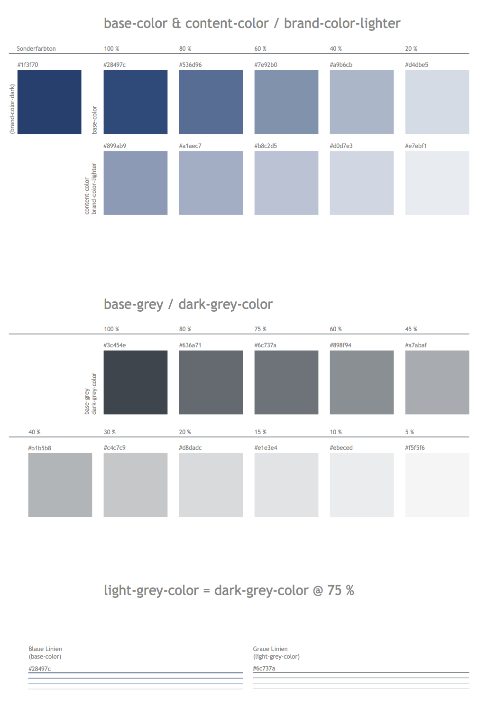
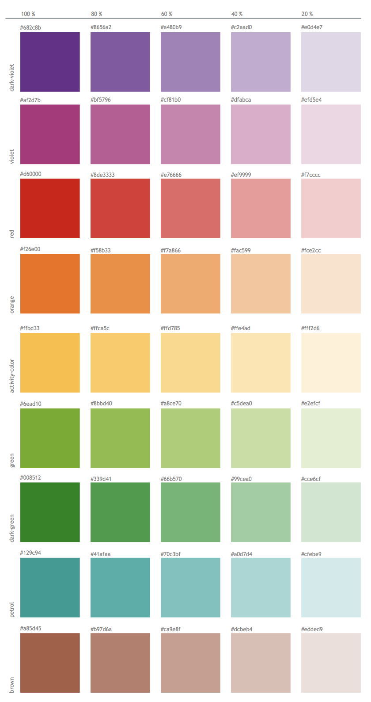
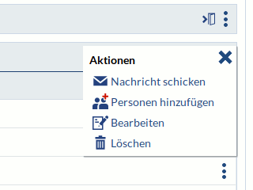
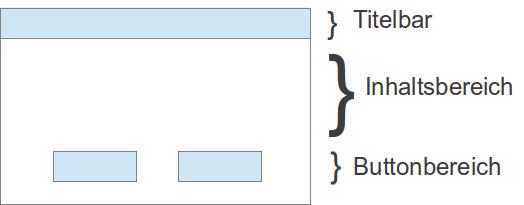
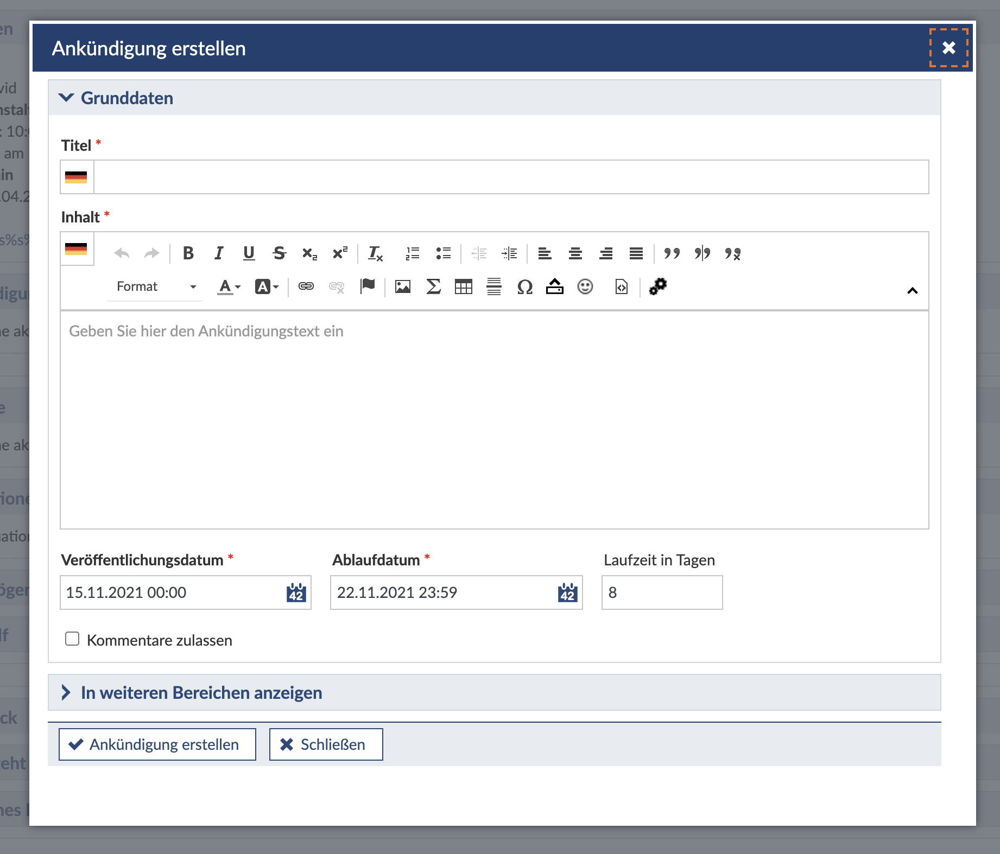
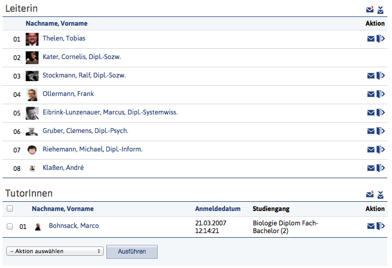

__Der Stud.IP Styleguide ist stets "work in progress".__

Für aktuelle Designfragen bieten wir vom Styleguide-Team (André, Cornelis, Marcus, Sabine, Marco) bis auf Weiteres jeden Donnerstag um 14.00 eine Design-Sprechstunde per Videokonferenz an. Die Konferenz findet in Skype statt.

# Einleitung

Stud.IP begleitet die Studierenden durch viele Jahre ihres Studiums und ist für die Lehrenden ein ständiger Begleiter bei ihrer täglichen Arbeit. Dieser Umstand verlangt Stud.IP eine gewisse beständige Motivationsfähigkeit ab, dass neue Funktionen sich konsistent und harmonisch in das Gesamtbild einfügen und dass sich ständig wiederholende Arbeitsabläufe möglichst einfach und zeitsparend erledigt werden können.
Diese und weitere Anforderungen spiegeln sich in der Stud.IP-Design Philosophie wieder, die diesen Style-Guide leiten soll:

Einfache Bedienbarkeit statt großem Funktionsumfang: Weniger ist mehr und daher soll Stud.IP nur jene Funktionen bereitstellen, die dem größten Teil der Nutzer hilft. Es gilt, die Bedürfnisse von 80% der Nutzern zu unterstützen, statt mit den besonderen Anforderungen der restlichen 20% die größere Gruppe zu überfordern. 
Ein gleicher Funktionsumfang für alle Veranstaltungen statt individuelle Anpassung an spezielle Bedürfnisse: Nutzer erhalten so eine verlässliche Umgebung unabhängig vom Einsatz in ganz unterschiedlichen Lehr- und Lernsituationen.
Verlässlichkeit in der Bedienung: Gleichartige Funktionen sollen stets konsistent umgesetzt werden. Bewährte Muster kommen systemweit zum Einsatz. Neue Ansätze sollen konsequent genutzt werden, so dass die gesamte Software von einer Weiterentwicklung profitiert, auch wenn dieses einen größeren Aufwand bei der Umsetzung bedeutet.
Behutsame Integration neuer Technologien: Die Nutzung neuer Internet-, Browser- oder Medientechnologien sollte nicht sollte nur verwendet werden, wenn ein Verbesserung für einen großen Teil der Nutzer technisch verfügbar ist. Gleichzeitig muss sichergestellt sein, dass ältere Konfigurationen in angemessenem Maße soweit unterstützt werden, dass eine Bedienbarkeit gewährleistet wird.
Stud.IP ist ebenso auf mobilen Geräten wie auf Dektop-Rechnern vollständig benutzbar. Dabei gilt jedoch kein reines "mobile first" Prinzip: Mobile Seiten können an bestimmen Bereichen (insbesondere für Administratoren und Administratorinnen) eingeschränkte Funktionalitäten bieten.

## Vier allgemeine Gestaltungsprinzipien für Stud.IP

"...the basic principles of design that appear in every well-designed piece of work."
> Robin Williams, The Non-Designer's Design Book

### Visuelle Gestaltung

Bezüglich der visuellen Gestaltung von Elementen innerhalb einer Seite gibt es viel zu beachten. Eine einfache Möglichkeit die Nutzbarkeit der jeweiligen Seite schnell zu erhöhen, ist die Beachtung der vier C.R.A.P.-Prinzipien:
* Kontrast (Contrast)
* Wiederholung (Repetition)
* Ausrichtung (Alignment)
* Nähe (Proximity)

Die im Folgenden vorgestellten Regeln gibt es auch als Poster Attach:studip-design-poster-final.pdf.

### Kontrast (Contrast)
* Kontrast dient als gestalterisches Mittel, um verschiedene Seitenelemente klar unterscheidbar voneinander abzuheben.
* Kontrast kann dazu verwendet werden, um auf wichtige Inhalte zu fokussieren.
* Nicht gleiche Elemente sollten sich deutlich voneinander unterscheiden.
* Kontrast kann über verschiedene gestalterische Elemente realisiert werden z.B. Schriftart, Farbe, Größen, Formen, Nähe, etc.

#### Negativbeispiele
* Dateien hochladen in Veranstaltungen - 9 gleichaussehende Button in einer Reihe

### Repetition (Wiederholungen):
* Wiederholungen schaffen Konsistenzen im System
* Ein konsistentes Design verbessert die Nutzbarkeit des Systems
* Konsistenzen können durch den wiederholten Einsatz verschiedenster gestalterischer Elemente erzeugt werden:
  ** Abstrakt: Menüstrukturen, Funktionsabläufe
  ** Konkret: Icons, Schriften, Bezeichnungen

#### Beispiele
* Hauptnavigationsleiste bleibt gleich
* Footer bleibt gleich
* Infobox/Sidebar

#### Negativbeispiele
* verschiedene Suchformularvarianten bei der Personensuche

### Ausrichtung (Alignment):
* Inhaltselemente sollten nicht willkürlich auf einer Seite platziert, sondern an anderen Elementen horizontal und vertikal ausgerichtet sein.
  Tipps
* Text sollte links- oder rechtsbündig ausgerichtet sein, aber nicht beides gleichzeitig auf einer Seite.
* Abstände sollten gleichmäßig sein.
* Kein rechts ausgerichteter Text in einer rechten Seitenspalte. Dies erzeugt zu viel Whitespace.
* Hilfslinien zeichnen, Abweichungen festzustellen

#### Negativbeispiel
* Assistent zum Anlegen von Veranstaltungen

### Nähe (Proximity)
* Inhaltselemente, die nah beieinander stehen, erwecken den Eindruck, dass sie zusammen gehören:
* Verwandte Inhaltselemente sollten daher räumlich nah zueinander gruppiert werden.
* Zwischen unterschiedliche Inhaltselementen sollte genug Abstand vorhanden sein, weil sonst ein Eindruck von Zusammengehörigkeit erweckt wird.
* Die Gruppierung der Elemente erhöht die Übersichtlichkeit und Inhalte werden besser strukturiert.

#### Negativbeispiel
* Gruppenverwaltung - TeilnehmerInnen einer Veranstaltung oder Kalender/Adressbuch - Button zum Hinzufügen zu einer Gruppe ist zu weit weg

### Weiterführende Informationen
* http://www.userfocus.co.uk/articles/A_CRAP_way_to_improve_usability.html
* http://www.dailyblogtips.com/crapthe-four-principles-of-sound-design/
* http://lab.christianmontoya.com/designing-with-crap/designing-with-crap-cc.pdf
* http://www.colorado.edu/AmStudies/lewis/Design/graprin.htm#summary
* http://blog.teamtreehouse.com/how-crap-is-your-site-design

# Seitenaufbau
Jede Seite von Stud.IP ist auf gleiche Art und Weise aufgebaut und enthält folgende Elemente:

Kopfzeile: Einleitende Zeile, die eine systemweite Suche beinhaltet. Wird die Hauptnavigation durch Scrollen aus dem Sichtbereich verschoben, wird diese in kompakter Form in der Kopfzeile aufgenommen. Die Kopfzeile kann vom Betreiber erweitert werden.
Hauptnavigation: Sie leitet jede Seite ein und ist das feststehende Navigationselement, das die Systembereiche miteinander verbindet. Die Zusammenstellung der Kopfzeile hängt von den globalen Rechten des Benutzers ab. Die Kopfzeile repräsentiert die 1. Navigationsebene.
Scopes: Scopes verbinden bestimmte Funktionen eines Hauptbereiches, etwa dem Nachrichtensystem oder alle Funktionen innerhalb von Veranstaltungen. Ein Scope besitzt einen Bereich bzw. ein Icon in der Hauptnavigation und verweist auf mehrere Funktionen. Ein Scope repräsentiert bzw. beinhaltet stets die 2. Navigationsebene.
Sidebar: Diese befindet sich am linken Bildschirmrand und enthält in definierter Form mehrere Widgets, etwa Navigation (der gewählten Funktion im gewählten Scope), Aktionen, Ansichten, Export und ggf. weitere Widgets.
Navigationswidget: Dieses Widget erscheint stets als erstes Widget und repräsentiert, wenn vorhanden, die 3. Navigationsebene.
Inhaltsbereich: Hier werden sämtliche Inhalte dargestellt. Ein Inhaltsbereich wird aus Tabellen und ContentBoxen bzw. Eingabefeldern gebildet. Für den Inhaltsbereich existieren feste Elemente, aus denen dieser gestaltet werden muss.
Fußzeile: Diese enthält weitere Links und Verweise, die analog zur Kopfzeile vom Betreiber erweitert werden kann.

//TODO: Screenshot einer idealtypischen Seite

Die eigentliche Seite setzt sich aus Sidebar und Inhaltsbereich zusammen. Beide Bereiche werden vom einem 
Seitentitel eingeleitet. Im Gegensatz zum Design bis Stud.IP 3.5 bringt der Inhaltsbereich nun keinen eigenen Titel 
(bisher teilweise als h1-Objekt gestaltet) mit.

## Kennzeichen des Seitentitels:

* Der Titel muss namensgleich mit dem Eintrag in der Navigation in der Sidebar sein
* Bei Veranstaltungen wird automatisch der Name der Veranstaltung mit ausgegeben (gleiches gilt für den Einrichtungsbereich bei gewählter Einrichtung)

## Weitere Vorgaben für den Seitenaufbau:

* Jede Seite enthält zwingend eine Sidebar.
* Jede Sidebar enthält mindestens ein Schmuckbild.
* am rechten Rand ist der Zugriff auf die Hilfe (Fragezeichen-Icon) als Abschluss des Seitentitels vorgesehen.
* Aktionen der Sidebar (zu finden im gleichnamigen Widget) werden in Dialogen ausgeführt.

Weitere Informationen zur Sidebar: siehe Abschnitt [Style#sidebar](Sidebar)

# Navigation

Die Navigation in Stud.IP ist in mehreren Ebenen organisiert. Es ist zu unterscheiden in:

* Hauptnavigation: Die Kopfzeile des Systems. Von hier aus werden komplette Funktionsbereiche erschlossen. Jeder 
  dieser Bereiche entspricht einem der Hauptpunkte in der Sitemap und jeder dieser Bereiche präsentiert sich mit einem eigenen Reitersystem.
* Scopes: Jeder Hauptbereich (zB. Profil oder Community) bringt einen Scope mit, der die Funktionen eines Bereiches 
  aufnimmt. Ein Scope entspricht jeweils der zweiten Ebene in der Sitemap. Eine Funktion darf nur an einer einzigen 
  Stelle in einem Scope eingehangen werden. Somit hat jede Funktion eine eindeutige Zuordnung zu einem der Hauptbereiche. 
* Navigation in der Sidebar: Verschiedene Aufgaben innerhalb einer Funktion finden sich im Navigationsbereich der 
  Sidebar. Diese führen an dieser Stelle zu einem neuen Seitenaufruf (im Gegensatz zu Aktionen in der Sidebar).
* Aus der Navigation der Sidebar sind auch Links in andere Hauptbereiche möglich, sollten jedoch vermieden werden. 
  Im Idealfall bleibt auch die Navigation einer Funktion innerhalb ihrer eigenen Aufgaben bzw. innerhalb des 
  jeweiligen Scopes. Ein Eintrag in der Navigation der Sidebar entspricht der dritten Ebene in der Navigation.

Weitere Hinweise zum Aufbau der Sidebar und ihrer unterschiedlichen Widgets findet sich im entsprechenden [Bereich 
des Styleguides](#Sidebar)

## Kopfzeile

Die Kopfzeile leitet jede Seite ein und bietet Zugriff auf alle Kernbestandteile von Stud.IP:

Mini:kopfzeile.png

Je nach Rechtestufe des angemeldeten Nutzers und eingerichteten Systemplugins werden unterschiedliche Systembereiche von hier aus zugänglich gemacht.

Die Kopfzeile sieht den größten Gestaltungsspielraum für Anpassungen an die Corporate Identity des Betreibers vor.

Folgende Anpassungen sind hier möglich:
* Einfügen des eigenen Logos an beliebiger Position (Vorschlag: Rechts neben dem Stud.IP Logo)
* Einfügen weiterer eigener Links in der Kopfzeile (Vorschlag: links neben der globalen Suchen)

Noch einige Hinweise zur Eigenanpassung der Kopfzeile:
* Entfernen Sie nicht die Icons aus der Kopfzeile, da die Icons ihre Gestaltung innerhalb des Systems wiederholt 
auftauchen und damit eine Verbindung zu dieser Navigation schaffen
* Entfernen Sie nicht die Beschriftung der Icons, da die Nutzer über diese Beschriftung wichtige Erklärungen erhalten 
  und der Text auch in anderen Systemsprachen zur Verfügung steht.
* Ändern Sie nicht die Reihenfolge der Icons oder teilen Sie die Icons in mehrere Zeilen auf.
* Ordnen Sie Kopfzeile nicht an andere Stellen (etwa als Seitenleiste) an. Das Stud.IP-System benötigt an einigen 
  Stellen teilweise eine sehr breite Darstellung. Die Kopfzeile ist in dieser Form am besten auf das System abgestimmt.

## Reite (Scopes)
Scopes fassen die Funktion eines Hauptbereiches (etwa alle Funktionen innerhalb einer Veranstaltung oder innerhalb des Nachrichtensystems) zusammen.

Mini:style_reiter.jpg

Stud.IP ergänzt in einem Scope (ebenso wie in der Hauptnavigation) automatisch einen "Überlauf", der in einem 
Drop-Down-Menü alle Icons aufnimmt, die nicht mehr in die horizontale Darstellung (je nach Bildschirmbreite) passen 
würde. Grundsätzlich sollte beim Entwerfen neuer Funktionen darauf achten, möglichst knappe Bezeichnungen zu wählen, 
sodass möglichst viele Funktionen nebeneinander Platz finden. Die Breite der jeweiligen Beschriftungen bedingt die Breite des Scopes!

## Sidebar

### Vorbemerkung

Das Konzept der Infoboxen (Stud.IP-Versionen bis 3.0) hat sich grundlegend geändert zum Sidebar-Konzept (ab Stud.IP 
3.1), das viele der Funktionen aus den alten Infoboxen aufnimmt, jedoch nicht direkt ersetzt. In Rahmen dieser 
Umstellung wurde die 3. Navigationsebene als Zeile unterhalb der Reiter in ein Navigationswidget der Sidebar verlegt.

Attach:Style/Sidebar-dafault.jpg

### Kurzbeschreibung
Die Sidebar befindet sich an fester Position am linken Rand einer Stud.IP-Seite. Die Sidebar ersetzt die Infobox älterer Stud.IP-Versionen und enthält mindestens eins, meistens mehrere Widgets. In der Sidebar befinden sich innerhalb von diesen Widgets die Elemente der 3. Navigationsebene, Aktionen, Ansichtsoptionen, seiteninterne Suchmöglichkeiten und Exportfunktionen. Sofern diese Standardwidgets nicht passend sind, kann eine Seite weitere Widgets haben.
Die Sidebar besitzt zudem Orientierungsbild im Kopfbereich, das den Namen der Seite enthält, das Baisisicon des jeweiligen Bereiches zeigt und einen Avatar aufnehmen kann.
Jede Seite sollte eine Sidebar besitzen.

### Aufbau & Elemente

#### Orientierungsbild
Das Orientierungsbild ist 520px breit und 200px hoch. Zu allen Basisfunktionen (bzw. aufbauend auf deren Icons) werden entsprechende Orientierungsbilder ausgeliefert. Grundsätzlich können Standorte diese Bilder tauschen, sollten aber darauf achten, dass Bildinhalt und Helligkeit zum umgebenden Design passen. Im Zweifel steht die Stud.IP-GUI-Gruppe bereit, weitere Bilder zu erstellen oder Tipps zu geben, wie man eigenen Bilder integrieren kann.

#### Typen von Widgets
| Typ | Beschreibung |
| ---- | ---- |
| Navigation | Enthält automatisch die 3. Navigationsbene entsprechend der Stud.IP-Navigationsstruktur (ehemals 3. Navigationsebene unterhalb der Reiterleiste). Navigationspunkte springen auf andere Seiten aber bleiben idealerweise innerhalb eines Navigationskontextes (=Reitersystem). Die aktuell gewählte Seite wird mit einem blauen Pfeil markiert. Navigationspunkte zeigen keine Icons. |
| Aktionen | Enthält Aktionen, die den Inhalt der aktuellen Seite beeinflussen. Aktionen öffnen grundsätzlich einen Dialog und verlassen somit nicht den aktuellen View, den der Nutzer sieht. |
| Ansichten | Diese enthalten Ansichtsoptionen bzw. Filter, die den angezeigten Content auf der jeweiligen Seite einschränken. Die jeweils gewählte Ansicht bzw. der Filter ist mit einem gelben Pfeil markiert. |
| Suche | Ein Such-Widget ist seitenspezifisch, ermöglicht also das Suchen innerhalb des Contents der Seite. Idealerweise gilt, dass eine Suche hier nur innerhalb des Contents filtert, den ich auf dieser Seite insgesamt sehen kann bzw. erreichen kann. Wenn der Content einer Seite selbst ein Suchergebnis liefert (z.B. bei allen Suchfunktionen in Stud.IP) muss diese Suche außerhalb der Sidebar, z.B. in einer Content-Box im Content-Bereich der Seite realisiert werden. Ein Suchwidget könnte dann theoretisch den gefunden Content dynamisch Einschränken, idealerweise ohne Reload der Seite |
| Export | Hier werden alle Funktionen aufgenommen, die konkret eine Datei (z.B. PDF, XLS-Export, CSV-Datei) zum Download anbieten. |

Grundsätzlich beginnen Seiten mit der Navigation und den Aktionen, dann folgende weitere Widgets (in der Regel Suche, Ansichten oder Export). Die weitere Widgets können je nach Nutzungshäufigkeit der jeweiligen Seite platziert werden, die ersten beiden Positionen sind in der Reihenfolge fest vorgegeben.


#### Weitere Typen von Widgets

Gelegentlich tauchen folgende Type auf:

| Type | Beschreibung |
| ---- | ---- |
| Einstellungen | Für Einstellungen, die sich direkt auf die Seite auswirken und schnell in der Sidebar vorgenommen werden sollen |
| Merkliste | Für das Zwischenspeichern von beliebigen Objekten |


### Was nicht in die Sidebar gehört

* Hilfetexte: Bisher oft in der Infobox verwendet, gehören erklärende oder einleitende Texte über die Funktion einer Seite nicht mehr in die Sidebar. Der beste Platz dafür ist die in der Version 3.1 neu geschaffene Hilfe-Lasche, in der auch Touren gestartet werden und der Link zum Hilfe-Wiki zu finden ist.
* Formulare: Mit Ausnahme eines Eingabefeldes für das Such-Widget gehören Formulare nicht in die Sidebar.

### Sonst noch zu beachten

* Für die Sidebar gibt es eine feststehende API, die für die Erstellung verwendet werden muss.
* Die Umstellung des Admin-Bereiches erfolgt voraussichtlich im Rahmen der Arbeiten der Version 3.2, bis dahin ist nur die Navigation in das entsprechende Widget verlegt.
* Außer im Navigationswidget sollten in der Sidebar eindeutige und passende Icons in der Farbe blau verwendet werden und klickbar sein. Insbesondere Aktionen profitieren von der leichten Auffindbarkeit durch Icon + Text.

## Inhaltsbereich

Der Inhaltsbereich umfasst alle jene Inhalte, die von der jeweiligen Funktion angezeigt oder bearbeitet werden.

In diesem Bereich finden alle Objektmanipulationen und die Inhaltsanzeige statt. Entscheidend ist, dass in diesem Bereich eigentlich nur Objekte (die als solche gekennzeichnet sind, siehe später), sie manipulierende Methoden und verschiedene weitere (Meta-)Informationen zu diesen Objekten platziert werden sollten. Erklärungstexte, verweise auf andere Systemteile und andere Navigationselemente dürfen nicht in diesem Bereich erscheinen.

Für die Gestaltung sollten standardisierte grafische Elemente verwendet werden, Funktionen, die bereits in ähnlicher Weise im System vorhanden sind, müssen sich in der Bedienung daran anlehnen. Gerade im Inhaltsbereich muss es das erklärte Ziel sein, mit bekannten Elementen zu arbeiten, um dem Nutzer eine vertraute Umgebung &#8211; auch bei neuen Funktionen &#8211; zu bieten.

Einige grundsätzliche Hinweise zur Gestaltung des Inhaltsbereiches:
* Vermeiden Sie, im Inhaltsbereich der Seiten Texte frei zu platzieren. Es gibt eine Reihe von grafischen Gestaltungsmöglichkeiten, die im folgenden beschrieben werden, mit denen Sie jedwede Inhalte innerhalb des Inhaltsbereiches markieren und jeweils von anderen Objekten abgrenzen können.


## Inhaltselemente

Generell gilt: Alle Elemente im Inhaltsbereich müssen durch passende Objekte eingefasst werden. Meistens sind dies Content-Boxen (bzw. Fieldareas in Formularen) oder Tabellen. Texte und Eingabemöglichkeiten dürfen nicht frei auf dem (weißen) Hintergrund gesetzt werden.

### Text
Fließtext sollte in Stud.IP durch die Verwendung semantisch entsprechender HTML Attribute strukturiert werden. Dies gilt auch für die Formatierung des Textbildes. Die inhaltliche und logische Struktur des Textes wird somit auf den Quellcode übertragen. Dadurch wird der Text nicht nur lesbarer für den Entwickler, sondern auch zugänglicher für Screenreader.

#### Übersicht der HTML Markups

##### Überschriften
Überschriften werden seit Stud.IP 4.0 im Inhaltsbereich nicht mehr verwendet. Entsprechende Auszeichnungen von Überschriften dürfen nur noch im Content der jeweiligen Funktion (etwa Wiki-Texte, Informationsseite oder Foren-Beiträge) verwendet werden, dienen aber nicht mehr der Gliederung oder Beschreibung des Inhaltsbereiches.

##### Einfache Listen und Aufzählungen
Um einfache Listen in Stud.IP darzustellen wird das `<ul>` - Markup verwendet. 
Entsprechende Listenelemente werden mittels `<li>` eingefügt. Auch für Listen gilt, dass diese durch gliedernde Elemente (in der Regel Content-Boxen) eingefasst werden.

Beispiel:

```html
<ul>
<li> Eintrag 1</li>
<li> Eintrag 2</li>
...
<li> Eintrag N</li>
</ul>
```

Weitere Elemente werden in den entsprechende Bereichen dieses Styleguides genauer beschrieben:

##### Tabellen
##### Formulare
##### Content-Boxen
##### Suchen


# Design
## Farben und Farbraum
Farben sind mit das wichtigste Gestaltungsmittel. Richtig eingesetzt, können Farben Anwendern helfen Aufgaben leichter durchzuführen.

Die Standard-Farben des aktuellen Stud.IP Designs wurden von den Core-Group
GUI-Verantwortlichen in Zusammenarbeit mit einem Designer festgelegt.

Das Farbschema baut auf einigen Grundfarben und festen Kontrastabständen auf.

Prinzipiell kann jede Stud.IP Installation durch Anpassen der CSS-Dateien farblich verändert werden. Zu beachten ist, dass jedoch nur die base-color angepasst werden sollte. Dadurch verändern sich andere Farben entsprechend den vorgegeben Farbwerten.
(Dies setzt allerdings voraus, dass die Farben in den less-Dateien angepasst werden und mit dem less-Compiler kompiliert werden. Auch ist zu beachten, dass die vollständige Implementierung der Stud.IP-CSS-Dateien erst in Zukünftigen Versionen umgesetzt sein wird).
Von allen Basisfarben sind in dem Farbklima Abschwächungen in 20% Schritten vorgesehen, die automatisch über den less-Compiler erzeugt werden.

### Bedeutung und Auswahl der Farben in Stud.IP

Farben sind mit Bedacht zu wählen, da diese wie optische Methaphern wirken und Emotionen ansprechen. Daher ist es wichtig, Farben konsistent zu verwenden. Bislang werden Farben in Stud.IP wie folgt eingesetzt:



PDF Download: [170804_Studip-Farbset.pdf](../assets/6d14189aa9093eb042bfa56eae8c7dc2/170804_Studip-Farbset.pdf)

#### Blau (base-color und content-color)
Blau ist in verschiedenen Abstufungen die Standard-Hintergrundfarbe für das aktuelle Stud.IP Theme.
Die Basisfarbe ist #28497c. Zur Hinterlegung von Content (also Inhalte innerhalb des Blatt Designs) wird der Farbwert #899ab9 als Basis genommen.

Blau wird zusätzlich für klickbare Objekte verwendet, d. h. mit blau werden Text-Links und klickbare Icons gekennzeichnet.

Blau ist auch die Hintergrundfarbe für [Messageboxen](MessageBox) mit Informationsmeldungen.

Die base-color kann von Betreiber angepasst werden an eigene Farben, zB. um dem eigenen CD zu entsprechen. Die content-color sollte nicht angepasst werden.

#### Grau (light-gray, dark-gray)

Zur Hinterlegung verschiedener Bereiche (zB. Infoboxen, Navigation) existieren unterschiedliche Grautöne, die frei verwendet werden dürfen. Die Basiswerte sind #69767f (light-gray) und #3c454e (dark-gray).
Inhalte (also Tabellen, Textbeiträge, Nachrichten, Formulare) dürfen nur mit der content-color (blau) hinterlegt werden. Andere Objekte können auch mit Grau hinterlegt werden.

### Markierungsfarben

Neben den Grundfarben werden Farben auch für unterschiedliche Markierungen/Kategorisierungen verwendet. Die dafür erlaubten Farben sind ebenfalls definiert:



#### Rot
Rot wird als Signalfarbe an mehreren Stellen eingesetzt:

Rot kennzeichnet zum einen kritische Aktionen und wird somit beispielsweise als Rahmenfarbe für Fehlermeldungen verwendet. Auch das Icon in einer Fehlermeldung  ist rot gefärbt.

Zum anderen wird alles Neue (aus Sicht des jeweiligen Nutzes) in Rot hervorgehoben. So kommen rote Icons beispielsweise auf der Seite "Meine Veranstaltungen" zum Einsatz, wenn einer der Bereiche einer Veranstaltung für den Nutzer neue Inhalte enthält. Auch in den Bereichen der Veranstaltungen gibt es an mehreren Stellen rote Markierung für neue Beiträge.

Basisfarbton für rot ist: `#d60000`

#### Grün
Grün wird lediglich für positive Rückmeldungen verwendet. Grün ist z. B. die Rahmenfarbe Meldungen mit Erfolgsbestätigung.

In der Gestaltung von Stud.IP.Inhalten oder anderen Elementen darf grün nicht eingesetzt werden!

#### Gelb (activity-indikator)
Gelb wird lediglich als Markierungsfarbe genutzt.

Beispielsweise ist der Indikator, welche Ansicht in einer Seite mit mehreren Ansicht gewählt wurde, ein gelber Pfeil.

Im Forum oder dem Wiki markiert die Farbe Gelb Fundstellen in der Trefferliste.

Gelbe Verschiebepfeile zum Umsortieren von Objekten sind in der aktuellen Gestaltung nicht mehr zulässig.

Basisfarbe ist `#ffbd33`

#### Schwarz und Weiß
Schwarz und Weiß werden als Schrift- und Kontrastfarbe verwendet. Schrift und Symbole werden je nach Hintergrund schwarz oder weiß gezeichnet.

#### Hinweise
Die hexadezimalen Werte der Farben sind in LESS-Dateien (`public/assets/stylesheets/mixins/colors.less`) definiert und müssen bei Anpassungen mit einem entsprechenden Less-Compiler in die Stylesheets übertragen werden.
Das händische Anpassen einzelner Farbwerke in den CSS-Dateien wird ausdrücklich nicht empfehlen, da einige Farben auch in Abhängigkeiten zueinander (etwa von der Base-color) definiert/erzeugt werden.

Die Verwendung von Farben für Icons wird im Abschnitt zu [Icons](Visual-Style-Guide#Icons) ausführlicher beschrieben.

### Allgemeine Hinweise zur Farbauswahl

#### Farben mit Bedacht und sparsam verwenden
Farben sollten sparsam verwendet werden. Um Bereiche im [Inhaltsbereich einer Stud.IP Seite](http://hilfe.studip.de/develop/Style/DesignSeitenlayout) durch Farbe zu kennzeichnen, empfiehlt es sich laut ISO 9241-12 nicht mehr als sechs (zusätzlich zu schwarz und weiß) verschiedene Farben zu verwenden. Die verwendeten Farben sollten durch den Anwender gut unterscheidbar sein.

#### Farbe nicht als alleiniges visuelles Hilfsmittel verwenden
Farben sollten nicht als einziges visuelles Mittel verwendet werden, um Informationen zu vermitteln oder Elemente zu kennzeichnen. Für  farbenfehlsichtige Nutzer ist es möglicherweise schwierig zwei Objekte  zu unterscheiden, die sich nur in ihrer Farbe unterscheiden. Unterschiede sollten zusätzlich durch z. B. unterschiedliche Formen, Positionen oder eine textuelle Beschreibung gekennzeichnet werden.

#### Farbtöne mit gleichen Sättigungsgrad verwenden
Um eine harmonisches Farbdesign zu erreichen, sollten Farbtöne verwendet werden, die den gleichen Sättigungsgrad aufweisen. Sättigung (bzw. Buntheit) bezeichnet den Grauanteil einer Farbe. Je weniger Grau eine Farbe enthält, desto leuchtender wirkt sie.

Große Flächen sollten nicht in leuchtenden (gesättigten) Farben gestaltet werden. Diese werden schwer lesbar und können mitunter Kopfschmerzen verursachen.

#### Ist der Kontrast zwischen Elementen und ihrem Hintergrund ausreichend?
Wenn sich der Farbton von Vorder- und Hintergrundfarben zu sehr ähnelt, sind Unterschiede schwer erkennbar.

Tipps zur Überprüfung des Kontrastes einer Farbkombination:
* Um zu überprüfen, ob ein ausreichender Kontrast vorhanden ist, empfiehlt es sich die Seite schwarz-weiß zu drucken. Wenn der Ausdruck gut lesbar ist, ist typischerweise ein ausreichender Kontrast vorhanden.
* Mit dem Online-Tool [Color Contrast Checker](http://www.snook.ca/technical/colour_contrast/colour.html) kann direkt überprüft werden, ob ein ausreichender Kontrast zwischen zwei Farben vorhanden ist.
* Auf manchen Betriebsystemen kann auch die Darstellung bereits als Grundeinstellung in Graustufen geschaltet werden, um die Kontraste zu testen.

#### Unruhige und ablenkende Hintergründe vermeiden
Ungünstig sind Muster oder Bilder im Hintergrund, die einen ungleichmäßigen Kontrast verursachen, das Auge vom Text ablenken und damit die Lesbarkeit erschweren.

### Weiterführende Links
* Tutorial: Farben im Webdesign [http://metacolor.de/](http://metacolor.de/)
* [Farb/Kontrastanalysen mit Bezug auf a11y-Kriterien](http://www.blog.mediaprojekte.de/grafik-design/farb-kontrast-analyse-die-accessibility-der-farben-testen)
* http://e-campus.uibk.ac.at/planet-et-fix/M8/8.5.2_Praesentationen/links/farben.html


# Icons

Seit der Version 2.0 bringt Stud.IP ein einheitliches Icon-Set mit. Das Set zeichnet sich durch eine klare und einheitliche Gestaltung, nach Aufgaben und Einsatzbereichen getrennte Farb-Sets, barrierearme Bedienung durch klare Formen/optische Zusätze für bestimme Aufgaben und eine Reihe weiterer Merkmale, die die Stud.IP-Formensprache vereinheitlichen, aus. Des weiteren liegen alle Icons bereits als Vektorgrafiken vor, so dass eine Verwendung in anderen Kontexten (zB. Print) und eine Veränderung der Icon-Größe in Stud.IP (etwa für eine verbesserte Touch-Bedienung) zukünftig möglich ist.
Das Iconset findet grundsätzlich für alle grafischen Schaltflächen, Markierungen, Objekt-Darstellungen usw. Anwendung. Als einzige Ausnahme davon existieren in Stud.IP weiterhin die Textbuttons und einige wenige Sonderformen oder nicht-iconartige Grafiklelemente (zB. Linien oder Trenner).


#### Gestaltung

Die Icon-Landschaft wurde deutlich entschlackt, moderner und effizienter gestaltet. Skalierbarkeit und eine einfache, klare Formensprache standen bei der Entwicklung im Mittelpunkt. Das neue Iconset ist funktional und selbsterklärend. So wird die Übersichtlichkeit der Funktionen und die intuitive Bedienung gefördert. Es gibt nun für alle Größen und Einsatzgebiete eine einheitliche Optik der neuen Icons. Die Verwendung von festen Grundformen zusammen mit förmlich und farblich abgegrenzten Zusätzen, die Funktionen und Zustände markieren, gewährleistet eine barrierearme Nutzbarkeit bei hohem Wiedererkennungseffekt.

Icons in Studip 2.0 sind nach einem festgelegten Raster gestaltet und minimalistisch in Farbe und Form. Sie sind grundsätzlich monochrom in festgelegten Farben gehalten. Linienstärke und Farbfüllungen werden so eingesetzt, dass die Icons ein einheitliches optisches Gewicht erhalten. Diese Regeln sollen künftig auf alle in Stud.IP verwendeten Icons übertragen werden.

Sicher gibt es zusätzlich zur normalen Projektentwicklung viele Plugins und Erweiterungen, bei denen einen Bedarf gibt, bestehende Icons anzupassen oder neue zu erstellen. Die dafür notwendigen Arbeiten übernimmt der Stud.IP e.V., der für die Entwicklung in Budget in gewissem Umfang bereithält. Koordiniert die Entwicklung über den Vorstand des Stud.IP e.V.

#### Icon-Rollen

Ab der Version 3.4 werden Icons über die Icon-API angesprochen. Bisher wurden Icons wie Dateinamen eingebunden. Damit war die verwendete Farbe hartkodiert. Wenn in Stud.IP-Installationen Anpassungen an das Farbschema der Hochschule vorgenommen wurden, musste daher der Code geändert bzw. unschöne "Hacks" vorgenommen werden.

Ab Stud.IP v3.4 werden Icons nicht mehr mit ihrer Farbe referenziert, sondern mit der Rolle, die sie übernehmen wollen.
Ein Beispiel: Bisher wurden alle Icons, die als bzw. in einem Link angezeigt wurden, im Code mit der Farbe Blau hartkodiert: `Assets::img('icons/blue/seminar')` Wollte eine Hochschule alle Link-artigen Icons lieber in der Farbe
Grün darstellen, mussten dafür grüne Icons in das Verzeichnis "blue" gelegt werden (Was aber auch nicht immer funktioniert,
wenn z.B. die Hintergrundfarbe dann dieselbe wie die Icon-Farbe ist.) oder alle entsprechenden Vorkommnisse von `blue` im Code durch `green` ersetzen.

Mit der neuen Icon-API wird nun die Rolle hartkodiert. Die globale Zuordnung von Rollen zu Farben übernimmt dann die entsprechende Übersetzung.

#### Rollen

Derzeit (Stud.IP v3.4) findet man die Zuordnung von Rollen zu Farben
in der Klasse "Icon" (`lib/classes/Icon.class.php`):

| Rolle | Farbe | Bedeutung |
| ---- | ---- | ---- |
| `Icon::ROLE_INFO`          | black | Alte Beschreibung: *Diese Icons werden ausschließlich in den Infoboxen verwendet und sind nie klickbar. Sie erläutern grafisch die Aktionen, die die Infobox anbietet. So können hier Aktionen mit dem zugehörigen Icon gezeigt werden, Informationen mit einem "I" illustriert werden oder Verweise auf andere Systembereiche mit den zu diesen Bereichen passenden Icons ergänzt werden.* | 
| `Icon::ROLE_CLICKABLE`     | %blue%blue | Alte Beschreibung: *Die blauen Icons sind der Standard für alle klickbaren Icons, unabhängig davon, in welchem Kontext sie verwendet werden (Ausnahme: Übersicht "Meine Veranstaltungen"). Insbesondere freistehende Aktionen sollten immer neben dem Linktext ein solches Icon zeigen. * | 
| `Icon::ROLE_ACCEPT`        | %green%green | Alte Beschreibung: *Grün kommt nur in dem Fall, dass der Bestätigungs-Haken gezeigt wird, zum Einsatz.* | 
| `Icon::ROLE_STATUS_GREEN`  | %green%green | Alte Beschreibung: *Grün kommt nur in dem Fall, dass der Bestätigungs-Haken gezeigt wird, zum Einsatz.* | 
| `Icon::ROLE_INACTIVE`      | %grey%grey | Alte Beschreibung: *Diese Variante kommt zum Einsatz, wenn Icons nicht klickbar sind und nicht innerhalb von Infoboxen eingesetzt werden. Sie drücken auch oft einen Status aus und werden für alle Objekte wie News, Votings oder Dateien verwendet, um ein solches Objekt zu klassifizieren. Eine Ausnahme bildet "Meine Veranstaltungen". Auch hier drücken die grauen Icons einen Zustand aus ("nur bekannte Objekte eines Types") aber können trotzdem geklickt werden, da von hier aus auch die jeweiligen Bereiche direkt angesprungen werden können. Dieser Sonderfall gilt jedoch nur für "Meine Veranstaltungen"* | 
| `Icon::ROLE_NAVIGATION`    | %ltblue%lightblue | | 
| `Icon::ROLE_NEW`           | red | Alte Beschreibung: *Die Farbe Rot dient dazu, Neues darzustellen oder hervorzuheben. Rote Icons kommen auf "Meine Veranstaltungen" zum Einsatz, wenn einer der Bereiche einer Veranstaltung für den Nutzer neue Inhalte führt. Aus Gründen der barrierearmen Bedienung reicht die rote Färbung allein nicht aus, es muss immer auch der Zusatz "neu" verwenden werden, um dem Icon auch eine eindeutige Form zu geben, es sei denn, die Kombination von Farbe und Form des Icons selbst ist eindeutig (etwa ein rotes X).* | 
| `Icon::ROLE_ATTENTION`     | red | Alte Beschreibung: *Die Farbe Rot dient dazu, Neues darzustellen oder hervorzuheben. Rote Icons kommen auf "Meine Veranstaltungen" zum Einsatz, wenn einer der Bereiche einer Veranstaltung für den Nutzer neue Inhalte führt. Aus Gründen der barrierearmen Bedienung reicht die rote Färbung allein nicht aus, es muss immer auch der Zusatz "neu" verwenden werden, um dem Icon auch eine eindeutige Form zu geben, es sei denn, die Kombination von Farbe und Form des Icons selbst ist eindeutig (etwa ein rotes X).* | 
| `Icon::ROLE_STATUS_RED`    | red | Alte Beschreibung: *Die Farbe Rot dient dazu, Neues darzustellen oder hervorzuheben. Rote Icons kommen auf "Meine Veranstaltungen" zum Einsatz, wenn einer der Bereiche einer Veranstaltung für den Nutzer neue Inhalte führt. Aus Gründen der barrierearmen Bedienung reicht die rote Färbung allein nicht aus, es muss immer auch der Zusatz "neu" verwenden werden, um dem Icon auch eine eindeutige Form zu geben, es sei denn, die Kombination von Farbe und Form des Icons selbst ist eindeutig (etwa ein rotes X).* | 
| `Icon::ROLE_INFO_ALT`      | %bgcolor=black white%white  | Alte Beschreibung: *Die weiße Variante wird immer dann verwendet, wenn Icons innerhalb einer dunklen Umgebung (in der Regel die Kopfzeile von frei schwebenden Fenstern mit dunkelblauer Zeile) vewendet werden. Auch graue Tabellenköpfe erhalten ggf. weiße Icons. In der Regel sind diese nicht klickbar. Das weiße Icon kann auf weißem Hintergrund nicht gesehen werden.* | 
| `Icon::ROLE_SORT`          | %bgcolor=black yellow%yellow | Alte Beschreibung: *Gelbe Icons werden ausschließlich zum Verschieben von Objekten benutzt. Daher existieren in diesem Set auch nur Dreiecke und Pfeile in allen Varianten.* | 
| `Icon::ROLE_STATUS_YELLOW` | %bgcolor=black yellow%yellow | Alte Beschreibung: *Gelbe Icons werden ausschließlich zum Verschieben von Objekten benutzt. Daher existieren in diesem Set auch nur Dreiecke und Pfeile in allen Varianten.* | 


#### Zusätze

Es existieren eine Reihe von grafischen Zusätzen, die vielfältig eingesetzt werden können, um Aktionen, die hinter Icons liegen oder auch Zustände zu visualisieren. In der Regel werden Zusätze immer in rot dargestellt. Eine Ausnahme bildet der gelbe Zusatz „Verschieben“.

Zusätze an Icons werden ab Stud.IP v3.4 über die Icon-API referenziert. Möchte man zB ein `seminar`-Icon als Link mit dem Zusatz `add` (also Hinzufügen) einbauen: `Icon::create('seminar+add')`

| Status | Bild |Beschreibung
| ---- | ---- | ---- |
|  `accept`     |   | **Akzeptieren**: Der Haken drückt aus, dass hier eine Bestätigung im Kontext des Objekts dargestellt wird. | 
|  `add`  |  | **Hinzufügen**: Das Plus-Zeichen drückt aus, dass hier ein neues Objekt erzeugt werden kann. Das Anlegen eines Objektes oder der Sprung auf einen Bereich, in dem das Anlegen möglich ist, wird mit diesem Zusatz belegt. Er kann an blauen Icons mit Klick oder schwarzen und grauen Icons verwendet werden.| 
|  `decline`  |  | **Aktion gesperrt**: Zuweilen werden Aktionen als "nicht möglich" dargestellt. In diesem Fall erhalten die Aktions-Icons ein X als Zusatz. | 
|  `edit`       |   | **Bearbeiten**: Der Stift an einem Objekt drückt aus, das mit einem Klick auf dies Icon ein Objekt bearbeitet werden kann. | 
|  `export`     |   | **Exportieren**: Über dieses Icon werden ein oder mehrere Objekte des entsprechenden Types exportiert (z. B. als CSV-Datei)| 
|  `move_right`  |  | **Verschieben**: Um ein Objekt zu verschieben, gibt es den Zusatz eines Pfeils. Bis zur Version 2.4 waren diese Zusätze gelb, seit der Version 2.5 sind alle Zusätze in rot zu halten.
|  `new`  |  | **Neu**: Das Sternchen drückt einen neuen Inhalt aus. Das Sternchen wird (außer in der Kopfzeile) mit einem roten Icon kombiniert.| 
|  `remove`  |  | **Löschen/Entfernen**: Mit einem Minus wird die Möglichkeit, das entsprechende Objekt zu löschen, markiert.| 
|  `visibility-visible` |   | **Sichtbar**: Ein Objekt wird bei Klick auf dieses Icon sichtbar geschaltet. | 
|  `visibility-invisible` |   | **Unsichtbar**: Ein Objekt wird bei Klick auf dieses Icon unsichtbar geschaltet.  | 


Das Icon-Set enthält im Bausatz noch weitere Zusätze, die aktuell jedoch nicht verwendet werden. So finden sich Pfeile in alle vier Richtungen, Pause-Zeichen, Bestätigen-Zeichen (als Gegenstück zum "X"), Minus-Zeichen (als Gegenstück zum Hinzufügen) und Aktualisieren.

#### Größen

Icon-Größen können über die Render-Methoden der Icon-API angegeben werden. Inzwischen werden Icons als frei skalierbare SVG ausgeliefert.
Seit der Version 5.0 wird die Größe im Icon nicht mehr mitgegeben (vormals 16 * 16 Pixel, außer anders angegeben).

#### Verzeichnisstruktur

War früher die modulare Verzeichnisstruktur wichtig, verbirgt die Icon-Klasse nun diese Implementationsdetails. Bei Verwendung der Icon-API kommt man damit nicht mehr in Berührung.

Historisch lagen die Icons in etwa dieser Verzeichnisstruktur:
`icons/<Größe>/<Farbe>/<Zuatz>/<Name des Icons>.png`

#### Liste der verfügbaren Icons

##### Stammicons

Für alle in Stud.IP vorhandenen Objekte existieren Stammicons, von denen alle weiteren Formen oder Varianten logisch abgeleitet werden. Gegenwärtig existieren folgende Stammicons:

(In vielen Fällen existieren sowohl gefüllte und transparente bzw. invertierte Varianten zu einem Stammicon. Hier ist in der Regel die normale Version und nicht die Alternative einzusetzen.)

| Bild | Lizenz | Beschreibung
| ---- | ---- | ---- |
|                | 60a               | **Lizenz nach §60a** Dokument-Weitergabe im Rahmen der §60a Lizenz (aktuell)| 
|                | CC               | **Lizenz nach CC** Dokument-Weitergabe im Rahmen von CC | 
|                | license               | **Lizenz allgemein**  | 
|                | own-license               | **Eigene Lizenz** Dokument-Weitergabe im Rahmen einer eigenen Lizenz/selbst erstellt | 
|                | public-domain              | **Freie Lizenz** Dokument-Weitergabe im Rahmen einer freien Lizenz| 
|                | accept               | **Akzeptieren/akzeptiert** Dieses Symbol ist die Grundform für positive Rückmeldungen an den Nutzer. | 
|                | action              | **Aktionsmenu** Icon zur Initiierung bzw. Verankerung des Aktionsmenu| 
|              | activity             | **Activity-Stream** | 
|           | no-activity          | **keine Aktivität im Activity-Stream** leerer Activity-Stream | 
|                   | add                  | **Hinzufügen** | 
|            | add-circle           | **Hinzufügen** für Popover | 
|                 | admin                | **Administration** Alle Administrationen des Systems | 
|               | archive              | **Archiv** für alles, was mit dem Archivieren zu tun hat | 
|              | archive2             | **Archiv Alternative** Alternative, die auch für Ordner o.ä. verwendet werden kann | 
|              | archive3             | **Archiv Alternative** Alternative, die auch für Ordner o.ä. verwendet werden kann | 
|            | assessment           | **Prüfungen/Asssessments** allgemeines Icon für Prüfungen | 
|            | audio           | **Audio-Element** allgemeines Icon für Audio-Inhalt | 
|            | audio3           | **Audio-Element** allgemeines Icon für Audio-Inhalt, Variante für Audio-Medienobjekt | 
|             | billboard            | **Schwarzes Brett** Icon für schwarze Bretter in Stud.IP | 
|            | block-accordion           | **Block-Icon für Akkordeon** Icon für den Courseware-Block Akkorden| 
|            | block-canvas           | **Block-Icon für Canvas** Icon für den Courseware-Block Canvas| 
|            | block-comparison           | **Block-Icon für Comparison** Icon für den Courseware-Block Bildvergleich| 
|            | block-eyecatcher           | **Block-Icon für Eye-catcher** Icon für den Courseware-Block Blickfang| 
|            | block-eyecatcher2           | **Block-Icon für Eye-catcher** Alternativ-Icon für den Courseware-Block Blickfang| 
|            | block-gallery           | **Block-Icon für Galerie** Icon für den Courseware-Block Bildergalerie| 
|            | block-gallery           | **Block-Icon für Galerie** Alternativ-Icon für den Courseware-Block Bildergalerie| 
|            | block-imagemap           | **Block-Icon für Imagemap** Icon für den Courseware-Block Imagemap| 
|            | block-imagemap2           | **Block-Icon für Canvas** Alternativ-Icon für den Courseware-Block Imagemap | 
|            | block-tabs           | **Block-Icon für Tabs** Icon für den Courseware-Block Tabs | 
|            | block-tabs           | **Block-Icon für Schreibmaschinen** Icon für den Courseware-Block Schreibmaschine | 
|               | blubber              | **Blubber** Icon für die Blubber-Funktion | 
|               | brainstorm              | **Brainstorm** Icon für das Brainstorm-Plugin | 
|                   | bus                  | **Bus** Icon für Navigationsfunktionen, zB. in Campus-Apps | 
|            | campusnavi           | **Campus-Navi** Icon für Navigationsfunktionen allgemein, zb. in Campus-Apps | 
|              | category             | **Kategorie** allgemeines Icon für Kategorien | 
|              | cellphone             | **Telefon/Handy** Telefonnummer, Smartphone usw. | 
|                  | chat                 | **Chat** Chat/Forum/Messenger) | 
|          | check-circle         | **Akzeptieren/akzeptiert** für Popover | 
|      | checkbox-checked     | **markierte Checkbox** Checkbox in Form eines Icons, markiert | 
|    | checkbox-unchecked   | **unmarkierte Checkbox** Checkbox in Form eines Icons, unmarkiert | 
|    | checkbox-indeterminate   | **uneindeutige Checkbox** Checkbox in Form eines Icons, uneindeutig (für Mehrfachselektion) | 
|   | radiobutton-checked  | **markierter Radiobutton** Radiobutton in Form eines Icons, markiert | 
|  | radiobutton-unchecked| **unmarkierter Radiobuttom** Radiobutton in Form eines Icons, unmarkiert | 
|             | classbook            | **Klassenbuch** Klassenbuch | 
|             | clipboard            | **Zwischenablage** Kopieren in Zwischenablage | 
|                  | cloud                 | **Cloud-Service** generisches Icon für Cloudservices | 
|                  | code                 | **Programmcode** generisches Icon für Programmcode | 
|               | code-qr              | **QR-Code** QR-Code | 
|              | computer             | **Computer** allgemeines Computer-Icon | 
|               | comment              | **Kommentar** | 
|               | comment2              | **Kommentar** Alternative für Kommentare| 
|             | community            | **Community** | 
|             | computer            | **Computer** allgemeines Icon für Computer (analog zu Telefon/Smartphone)| 
|          | consultation         | **Sprechstunden** | 
|          | content         | **Inhalte** allgemeines Icon für Inhalte| 
|          | courseware         | **Basis-Icon Courseware** | 
|          | crop         | **Beschneiden** Beschneiden von Bildern (zB. Avatar-Bilder) | 
|                 | crown                | **Krone** | 
|                  | date                 | **Termin** | 
|                  | date-single                 | **Einzeltermin** | 
|                  | date-cycle                 | **regelmäßiger Termin** | 
|                  | date-block                 | **Blocktermin** | 
|               | decline              | **ablehnen** Dieses Symbol ist die Grundform für negative Rückmeldungen an den Nutzer. | 
|               | decline-circle              | **ablehnen** Ablehnen-Variante im Kreis| 
|          | dialog-cards         | **Visitenkarten** Icon für Visitenkarten/Adressen | 
|          | doctoral-cap         | **Prüfungen/Abschlüsse** allgemeines Icon für Prüfungen | 
|                  | doit                 | **Do.IT**Do.IT-Plugin und andere aufgabenbezogene Funktionen | 
|            | door-enter           | **Login/Betreten** | 
|            | door-leave           | **Logout/Verlassen** | 
|              | download             | **Download** | 
|              | dropbox             | **Cloud-Service Dropbox**Alternative | 
|                  | edit                 | **Editieren** allgemeines Editieren-Icon | 
|                  | elmo                 | **Elmo** Icon für Elmo-Plugin | 
|            | eportfolio           | **ePortfolio-Icon**  | 
|                  | euro                 | **Euro** Währungszeichen/Geld | 
|            | evaluation           | **Evaluation** generelles Icon für Evaluationen | 
|               | exclaim              | **Hinweis** | 
|        | exclaim-circle       | **Hinweis** für Popover | 
|                | export               | **Export** | 
|              | facebook             | **Facebook** Facebook-Anbindung oder Verknüpfung * | 
|              | favorite             | **Favorit/Like** Favoriten-Icon * | 
|                  | file                 | **Dokument** | 
|                 | files                | **Dokumente/Dateibereich** | 
|          | file-archive         | **Zip-Datei** | 
|            | file-audio           | **Audio-Datei** | 
|            | file-audio2           | **Audio-Datei** | 
|            | file-sound           | **Audio-Datei** Alternative, zB. für laute Audiodateien| 
|              | file-pic             | **Bilddatei** | 
|              | file-pic2             | **Bilddatei** Alternative| 
|              | file-pdf             | **PDF-Datei** | 
|              | file-presentation             | **Präsentation-Datei** generische Variante, ohne Power Point-Bezug
|              | file-spreadsheet             | **Tabellenkalkulation'-Datei** generische Variante, ohne Excel-int-Bezug
|           | file-office          | **Office-Dokument** Word/PowerPoint/Excel | 
|           | file-excel          | **Excel-Dokument**  | 
|              | file-video             | **Video-Datei** |  
|              | file-video2             | **Video-Datei** Alternative |  
|           | file-word          | **Word-Dokument**  | 
|           | file-ppt          | **PPT-Dokument**  | 
|             | file-text            | **Textdatei** (zB. Word) | 
|          | file-generic         | **generischer Dateityp** | 
|          | filter         | **Suchfilter, Ansichtsfilter** | 
|          | filter         | **Suchfilter, Ansichtsfilter** Alternative| 
|          | fishbowl         | **Goldfisch im Glas** ungenutzt| 
|          | folder-broken         | **nicht erreichbarer Ordner** | 
|          | folder-date-full         | **gefüllter Terminordner** | 
|          | folder-date-empty       | **leerer Terminordner** | 
|          | folder-edit-empty         | **leerer editierbarer Ordner** | 
|          | folder-edit-full         | **voller editierbarer Ordner** | 
|          | folder-empty         | **leerer Ordner** | 
|           | folder-full          | **gefüllter Ordner** | 
|           | folder-group-empty         | **leerer Gruppenordner**| 
|           | folder-group-full         | **gefüllter Gruppenordner**| 
|           | folder-home-empty          | **leerer Home-Ordner**| 
|           | folder-home-full          | **gefüllter Home-Ordne**| 
|           | folder-inbox-full      | **gefüllter Inbox-Ordner** | 
|           | folder-inbox-empty          | **leerer Inbox- Ordner**| 
|           | folder-lock-full         | **gefüllter geschützter Ordner** | 
|           | folder-lock-empty          | **leerer geschützter Ordner** | 
|         | folder-parent        | **übergeordneter Ordner** | 
|         | folder-plugin-market-empty.svg)         | **Ordner Plugin-Marktplatz leer** | 
|         | folder-plugin-market-full.svg)         | **Ordner Plugin-Marktplatz gefüllt** | 
|         | folder-public-empty.svg)         | **öffentlicher Ordner, leer** | 
|         | folder-public-full.svg)         | **öffentlicher Ordner, gefüllt** | 
|         | folder-topic-empty       | **leerer Themenordner** | 
|         | folder-topic-full        | **gefüllter Themenordner** | 
|                 | forum                | **Forum** | 
|                 | fullscreen-on                | **Vollbild ein** | 
|                 | fullscreen-off              | **Vollbild aus** | 
|                 | globe                | **Globus/Weltkarte** | 
|                 | glossary                | **Glossar** | 
|                 | graph                | **Graph/Auswertung** generelles Icon für grafische Auswertungen (zB. Evalautionsauswertung) | 
|                 | group                | **Permalink** neu, ehemals Gruppieren | 
|                | group2               | **Gruppe/gruppieren** Gruppen (Menschen) | 
|                | group3               | **Gruppe/Hierarchie** Gruppen/Hierarchie | 
|                | group4               | **Gruppe/gruppieren** Gruppieren nach Farbe | 
|             | guestbook            | **Gästebuch** | 
|                  | hamburger                 | **Hamburger-Menu** für mobile Ansicht| 
|                  | home                 | **Startseite** | 
|                  | info                 | **Information** | 
|           | info-circle          | **Information** für Popover | 
|              | infopage             | **Freie Infoseite** | 
|                 | inbox                | **Nachrichten Eingang** | 
|                | outbox               | **Nachrichten Ausgang** | 
|               | install              | **Plugin Installation** | 
|             | institute            | **Einrichtung** | 
|                 | item                | **Allgemeines Objekt für Kommentare** Kommentarobjekt | 
|                   | key                  | **Password** Password(-verwaltung) | 
|                   | knife                  | **Taschenmesser/Tool** alternative für Tool-Icon | 
|           | learnmodule          | **Lernmodul** | 
|           | lightbulb          | **Glühbirne** etwa für Tipps, Ideen oder Brainstorming| 
|           | link-extern          | **externer Link** | 
|           | link-intern          | **interner Link** | 
|          | link2         | **externer Link** Alternative, rechts-orientierte Seiten| 
|          | link3          | **externer Link** Alternative, links-orientierte Seiten| 
|            | literature-request           | **Literaturanfrage** | 
|            | literature           | **Literatur** | 
|           | lock-locked          | **Schloss im geschlossenen Zustand** | 
|         | lock-unlocked        | **Sperren/Schloss im geöffneten Zustand** | 
|                   | log                  | **Protokoll/Log** | 
|                  | mail                 | **Nachricht** | 
|                  | maximize                 | **Maximieren** für Widgetsystem| 
|                 | medal                | **Prüfungen/erreichte Leistungen** allgemeines Icon für Prüfungen | 
|                 | mensa                | **Mensa** Mensa, vegetarisch | 
|                | mensa2               | **Mensa** Mensa | 
|                 | metro                | **U-Bahn, Bahn** zB. für Campus-App | 
|                 | microphone                | **Mikrofon** zB. für Medien | 
|                | module               | **Modul** in Abgrezung zu Lernmodul oder Plugin | 
|                 | money                | **Mensa** Bezahlvorgänge, Kostenpflichtiges | 
|                  | network                 | **Netzwerk** ungenutzt | 
|                  | news                 | **Ankündigungen** Ankündigungen | 
|         | notification        | **Notifikation** Notifikation | 
|         | notification2        | **Notifikation** Notifikation, Alternative | 
|         | outer-space        | **Planet/Weltall** ungenutztes Icon, frei zur Nutzung | 
|         | oer-campus        | **OER-Campus** Basisicon für den OER-Campus| 
|         | opencast        | **Opencast** Icon für das Opencast-Plugin| 
|                 | perle                | **Perle** Icon für Perle Plugin | 
|                 | permalink                | **Permalink** Icon zum Abrufen/Verlinken eines Permalinks | 
|                | person               | **Person/Profil** | 
|               | persons              | **Personen** | 
|         | person-online        | **Person online** Person ist online | 
|                | picture               | **Bild** allgemeines Icon für Bilder, zB. in Courseware| 
|                 | phone                | **Telefon** klassisches Telefon, abgegrenzt von Handy| 
|                 | place                | **Ort** Ort/Geoinformation/Place | 
|                 | plugin                | **Plugin** Allgemeines Icon für Plugins | 
|                 | powerfolder                | **Clound-Dienst Powerfolder**  | 
|                 | print                | **Drucken** Druckfunktionen, Druckansicht | 
|               | privacy              | **Privatsphäreneinstellungen** | 
|                | remove               | **Entfernen** Entfernen, auch im Sinne von Verringen (korrespondiert mit dem Entfernen-Zusatz) | 
|                   | add                  | **Hinzufügen** Hinzufügen, auch im Sinne von Erhöhen (korrespondiert mit dem Hinzufügen-Zusatz) | 
|              | question             | **Frage** | 
|       | question-circle      | **Frage** für Popover | 
|               | ranking              | **Ranking**  | 
|               | radar.              | **Radar**  | 
|               | refresh              | **aktualisieren** | 
|             | resources            | **Ressource/Ressourcenverwaltung** | 
|             | resources-broken            | **kaputte Ressource** | 
|             | resource-label            | **Ressourcen-Label** | 
|                | rescue               | **Support/Hilfe Alternative** | 
|                 | roles                | **Rollen** | 
|                | roles2               | **Alternative für Rollen/Rechte** | 
|                | rotate-left               | **Bildbearbeitung drehen links** | 
|                | rotate-right               | **Bildbearbeitung drehen rechts** | 
|            | room          | **Basisicon für Räume** | 
|            | room2          | **Basisicon für Räume**  Alternative | 
|            | room-clear           | **Raum frei** | 
|         | room-occupied        | **Raum belegt** | 
|          | room-request         | **Raum anfrage** | 
|            | remove          | **Entfernen** | 
|            | remove-circle          | **Entfernen** für Popover | 
|            | rotate-left          | **Drehen gegen den Uhrzeigersinn** für Bildbearbeitung | 
|            | rotate-right          | **Drehen im Uhrzeigersinn** für Bildbearbeitung | 
|                   | rss                  | **RSS-Feed** | 
|              | schedule             | **Kalender/Ablaufplan** | 
|              | settings           | **Einstellungen**  | 
|              | settings2            | **Einstellungen** Alternative für Einstellungen | 
|              | share            | **Teilen/Exportieren** allgemeines Icon für das Teilen von Objekten | 
|                | search               | **Suche** | 
|               | seminar              | **Veranstaltung** | 
|       | seminar-archive      | **Veranstaltungsarchiv** | 
|               | smiley              | **Smiley/Emoji** | 
|                 | skype                | **Skype** | 
|                | span-empty               | **Füllstand/Progress: 0%** | 
|                | span-1quarter              | **Füllstand/Progress: 25%** | 
|                | span-2quarter               | **Füllstand/Progress: 50%** | 
|                | span-3quarter               | **Füllstand/Progress: 75%** | 
|                | span-1third               | **Füllstand/Progress: 33%** | 
|                | span-2third               | **Füllstand/Progress: 66%** | 
|                | span-full               | **Füllstand/Progress: 100%** | 
|                 | spiral                | **Spirale** ungenutzt | 
|                 | sport                | **Sport** zB. für Campus-App | 
|                | smiley               | **Smiley** | 
|                | staple               | **Anhang** | 
|                  | star                 | **Bewertungsstern** | 
|                  | stat                 | **Statistiken** | 
|            | studygroup           | **Studiengruppe** | 
|               | support              | **Support** | 
|                   | table-of-contents                  | **Inhaltsverzeichnis**  | 
|                   | tag                  | **Tag** Tags an Systemobjekten | 
|                   | tan                  | **TAN** Vergabe, Nutzung von TANs, Prüfungen | 
|                   | tan2                  | **TAN** Vergabe, Nutzung von TANs, Prüfungen, Alternative | 
|                  | test                 | **Test** | 
|             | timetable            | **Timetable** | 
|                 | tools                | **Tools** | 
|                 | topic                | **Thema** für Themen in Veranstaltungen | 
|                 | trash                | **Mülleimer/löschen** | 
|               | twitter              | **Twitter** | 
|              | twitter2             | **Alternative Twitter** | 
|              | twitter3             | **Alternative Twitter** | 
|                | ufo               | **Ufo** gibt es sie wirklich?| 
|             | unit-test            | **Unit-Tests** Unit-Tests | 
|                | upload               | **Upload** | 
|                 | vcard                | **vCard/Visitenkarte** | 
|                 | video                | **Video** Video | 
|                 | video2                | **Video** Video/Film | 
|                 | view-list                | **Umschalter Liste/Kacheln Liste** | 
|                 | view-wall                | **Umschalter Liste/Kacheln Kacheln/Wall** | 
|    | visibility-checked   | **Sichtbarkeit an** Umschalter Sichtbarkeit: an | 
|    | visibility-visible   | **sichtbar/Sichtbarkeit an** Objekt ist sichtbar oder Umschalter Sichtbarkeit: aus | 
|  | visibility-invisible | **unsichtbar** Objekt ist unsichtbar | 
|                  | vote                 | **Umfrage** | 
|          | vote-stopped         | **angehaltene Umfrage** | 
|                  | wiki                 | **Wiki** | 
|                  | wizard                 | **Assistent** Icon für Assistenten | 
|               | youtube              | **Youtube** | 
|               | zoom-in              | **Zoom in** Zoomen für Bildupload | 
|               | zoom-in2              | **Zoom in** Zoomen für Bildupload, Alternative | 
|               | zoom-out          | **Zoom out**  Zoomen für Bildupload| 
|               | zoom-out2             | **Zoom out**Zoomen für Bildupload, Alternative | 


##### Play Pause und Stop


##### Listen und Pfeile


 Pfeile, Blätterfunktion (zB. Seite weiter, vor/zurück)\\


 Pfeile zum Verschieben (zB. Objekt eintragen, Vertauschen von Objekten use.)\\


 Pfeile zum Springen an das Ende einer Liste (Springen an das Ende einer Tabelle, finer Liste von Objekten usw.)

# Schrift

## Vorbemerkung

In Stud.IP wird eine einheitliche Schriftart verwendet. Im Gegensatz zu früheren Versionen, in dem Betriebssystem und Browser die Schriftart bestimmt haben (in der Regel Arial oder Helvetica, serifenlose Schriftarten), liegt die Festlegung nun in den Stylesheets von Stud.IP. Das bietet eine Reihe von Vorteilen (festgelegte Formatierung Größen, tendenziell mehr wie in Print-Designs) aber auch Nachteile (unterschiedliche Darstellung, Lesbarkeit, Probleme mit Webfonts in bestimmten Browsern).

## Schriftart Lato

In Stud.IP kommt durchweg die Schriftart Lato zum Einsatz. Lato ist ein frei verfügbarer Google Font:

https://www.google.com/fonts/specimen/Lato

# CSS (Übersicht)

## Interaktionselemente
 Text muss noch aktualisiert werden

* Was soll anklickbar sein?
  * Navigationselemente
  * Buttons mit Text
  * Textlinks: Textlinks sollen nicht im Fließtext von Systembestandteilen (zB. in Onfoboxen) erscheinen, auch wenn dies in der Vergangenheit häufig so gemacht wurde. Textlinks erscheinen nur im Fließtext eines Feldess (Nutzereingabe oder Systemfeld) und werden durch die Formatierungsfunktionen in diesem Fall mit dem Link-Icon versehen. Nur in diesem Fall kann der Nutzer diesen Link leicht vom Fließtext unterscheiden.
  * Icons: Grundsätzlich sollen Icons nur in der blauen Variante klickbar sein (die Farbe entspricht der normalen Linkfarbe), Ausnahmen gibt es derzeit auf der Seite "Meine Veranstaltungen" und bei einigen Objekticons. Die Ausnahmen sollen Ausnahmen bleiben, dh. neue klickbare Icons sind grundsätzlich in Blau zu halten. Für Aktionen wie Anlegen, löschen oder Verschieben gibt es Zusätze (in der Regel rot), die auf die besondere Funktion dieses Icons hinweisen. (siehe unter [Icons](Visual-Style-Guide#Icons))

* Wann benutzt man zur Interaktion einen Textlink, wann einen Tab, wann einen Button mit Text und wann ein Icon?
  * Tab: Umschalten zwischen verschiedenen Ansichten/Aspekten eines Objekts
  * Textlink: Navigation zu einer anderen Seite, keine "Aktion" i.e.S.
  * Icon: Auslösen einer Aktion
  * Button: Auslösen einer Aktion
  * Wann benutzt man ein Icon und wann einen Button?

* Wie sollen Buttons benannt werden?
  * Beispiel: "übernehmen" vs. "abschicken" vs. "OK" vs. "speichern" vs. ...

* Welche Icons stehen für welche Aktionen?
  * Beispiel: gelber Doppelpfeil (sortieren? Objekte verschieben? Objekte kopieren? Weiterblättern?)
  * Müsste für alle Icons durchgegangen werden.
  * IconListe

* Grundlegendes
  * Wozu dienen Icons?
  * Wann sollen interaktive Icons, wann Buttons, wann Text-Links verwendet werden?
  * Buttons
    * zum Auslösen von Aktionen
      * im Inhaltsbereich
  * Icons
    * zum Auslösen von Aktionen
    * außerhalb des Inhaltsbereichs
    * oder dort, wo für Buttons nicht genug Platz ist (z. B. in Tabellen)
  * Textlinks
    * zum Wechsel auf andere Seiten innerhalb von Stud.IP oder aus Stud.IP heraus
    * nicht zum Auslösen von Aktionen
    * überall (im Inhaltsbereich, in Infoboxen usw.)

### Buttons

Stud.IP verwendet klar erkennbare Buttons zum Bestätigen und Abschließend von Aktionen sowie gelegentlich zur Initiierung von Hauptaktionen im System.  Haupteinsatzzweck von Buttons ist das Abschließen von Aktionen, insbesondere am Ende/Fuß eines Dialoges oder beim Löschen von Objekten.
Als Faustformel, wann ein ein Button und wann ein Icon verwendet werden kann gilt:

* Initiierung: In der Rel werden die meisten Aktionen in Stud.IP durch Icons (teilweise mit daneben gesetztem Text) initiiert. Typische Beispiele sind die Sidebar, Icons in Tabellenköpfen oder -Zeilen und sämtliche Icons in der Hauptnavigation. Dies ist einerseits durch Größeneinschränkungen begründet (Icons benötigen signifikant weniger Platz) oder das Vorhandensein einer Vielzahl an Aktionen (drei oder mehr Icons neben oder gar untereinander sind für die Usabilty besser darstellbar, als die gleiche Anzahl an Buttons). Es gibt jedoch auch Kontexte, in den Buttons zur Initiierung verwendet werden können. Dies ist insbesondere dann sinnvoll, wenn die Umgebung der Seite ausreichend Platz bietet und keine Standardelemente (Tabellen oder Content-Boxen nutzen in der Regel ausschließlich Icons) verwendet werden. Gleichzeit können Buttons verwendet werden, wenn eine Aktion besonderes Gewicht bekommt (zB. das Löschen eines Objektes).
* Bestätigung und Abschließen: Ein guter Einsatzzweck eines Buttons ist Stets das Bestätigen und Abschließen einer Aktion, etwa am Ende eines Dialoges nach dem Eingeben einer Vielzahl von Daten. Auch das Löschen, am Ende eines Dialoges oder eines Formular sowie das Abbrechen von Dialogen sind typische Einsatzzwecke eines Buttons.

Zu Beachten ist, dass ein Button stets eine Aktion als ausgeschriebenes Wort, jedoch in der Regel ohne Icon zeigt. Icons hingegen sind oft lediglich in ihrer grafischen Form zu sehen, werden jedoch häufiger (Sidebar, Aktionsmenu) auch mit Text ergänzt. Dennoch ist ein Button stets dass "gewichtigere" Interaktionselement, da er größer ist, einen Hover-Effekt bietet und auch (im Verhältnis zu Icons) durch seien große Fläche leichter zu bedienen ist. Das gilt insbesondere für Touch-Geräte.

#### Beschriftung und Labelling

Buttons werden in der Regel mit der Aktion des Namens als Substantive beschriftet (das "Abschließen", das "Abbrechen" und das "Speichern"). Substantiv-Verb-Konstruktionen sind zu vermeiden ("Speichern" wäre dem Button "Datei speichern" vorzuziehen). Ganze Sätze ("Diese Datei speichern.") sind nicht zulässig. Ideal ist also ein Button, der lediglich ein Wort enthält.
Dabei soll die Beschriftung die Funktion des Buttons möglichst klar beschreiben. Es soll erkennbar sein, was passieren wird, wenn man den auf den Button drückt.
Bei der Wortwahl sind jedoch spezifische substantivierte Verben zu verwenden. "OK" ist kein guter Button, da nicht klar erkennbar ist, was passiert. "Speichern" hingegen beschreibt einen Button korrekt.
Im Standarddesign wird die Beschriftung automatisch zentriert ausgegeben.


#### Erscheinungsbild
Buttons erscheinen in Stud.IP als weiße Buttons mit starken, dunkelblauen Rand. Buttons werden als knickbares Objekt grundsätzlich Blau eingefärbt. Rote oder Grüne bzw. anders gefärbte Buttons sind nicht erlaubt. Eine gefährliche Aktion (zB. "Löschen") muss einerseits durch geeignete Platzierung des Buttons und durch weitere Absicherungen (Warndialog) geschützt werden, nicht jedoch durch Warnfarben des Buttons.
In einigen Fällen sind noch Icons in Buttons zu sehen (Haken, X oder ähnliches). Diese Ergänzung eines Buttons durch Icons ist nicht mehr zulässig.

#### Platzierung und Ausrichtung der Buttons

Buttons dürfen nicht im Textfluss platziert werden und müssen immer freistehendend platziert werden. Idealerweise gibt es keine weiteren Objekte links und rechts eines oder mehrerer Buttons im gestaltbaren Bereich (zB. Dialog, Tabellenzeile, Content-Box).
In Formularen sind Buttons linksbündig zu setzen, in Dialogen mittig. Allerdings gibt es Ausnahmen, wenn die Funktion des Buttons eines bestimmte Position impliziert. So sollten "Zurück" und "Weiter"-Buttons innerhalb eines Dialoges entsprechend linksbündig und rechtsbündig gesetzt werden.

#### Reihenfolge mehrerer Buttons nebeneinander:
Für Buttons soll eine bestimmte Reihenfolge eingehalten werden:
1. Positiver, bestätigender Button ("Speichern", "Übernehmen", "Ja")
2. Negativer Button ("Nein")
3. Harmloser/abbrechender Button, der den Zustand nicht verändert ("Abbrechen", "Schließen")

### Verhalten
Stud.IP kennt neben aktiven Buttons auch inaktive Buttons. Diese sind ausgegraut und können nicht geklickt werden, weisen aber darauf hin, dass unter anderen Umständen dieser Button klickbar wäre (hier kann ein Info-"i"-Icon mit Tooltip daneben erklären, warum der Button nicht klickbar ist).
Sollte ein Default-Button definiert sein, der bei Tastendruck (z.B. Enter) aktiviert wird, muss dies stets ein harmloser Button ("Nein", "Abbrechen" oder "Schließen") sein. Für den Fall, dass bereits Daten in einem zugehörigen Formular erfasst wurden, gibt es (zumindest in Dialogen) eine Eigenschaft, die das Schließen des Dialoges nach Eingabe ohne eine weitere Bestätigung verhindert. Generell ist darauf zu achten, dass eine Default-Option keinen Datenverlust nach sich ziehen kann.

----

**Allgemein** \\
Nutze Bestätigungs-Buttons nach den folgenden Design-Patterns:


|      **Pattern**       |       **Commit buttons**       | 
| ---- | ---- |
| Frage-Dialog (mit Buttons) | Eine der folgenden spezifischen Bezeichnergruppen: Ja/Nein, Ja/Nein/Abbrechen, [Do it]/Abbrechen, [Do it]/[Don't do it], [Do it]/[Don't do it]/Abbrechen| 
| Auswahl-Dialoge | **Modaler Dialog:** OK/Abbrechen oder  (Do it)/Abbrechen  
| |**Nicht-modaler Dialog**: Schließen-Button in der Dialogbox und der title bar|   

## Aktionsmenüs



Ein Aktionsmenü verkapselt eine Liste von kontextbezogenen Aktionen und kann an folgenden Stellen verwendet werden:
* Bei Aktionen für ein Element in einer Liste oder Tabelle.
  * Beispiele: Teilnehmer, Veranstaltungen, Fragebögen
* Bei Aktionen für einen Bereich, der einen Inhalt umschließt und keine eigenen Aktions-Buttons hat.
  * Beispiele: Tabellen, Gruppen von Personen, Widgets auf der Startseite

In diesem Fall steht das Aktionsmenü ganz rechts, wo sonst die Aktions-Icons einzeln aufgeführt sind. Generell sollte ein Aktionsmenü anstelle einer Auflistung von Icons eingesetzt werden, wenn mehr als drei Aktionen direkt nebeneinander stehen (dabei zählen auch inaktive bzw. ausgeblendete Aktionen mit) oder die Icons nicht selbsterklärend sind und durch Text erklärt werden sollen.

Allgemeine Richtlinien bei der Verwendung eines Aktionsmenüs:
* Die primäre Aktion eines Elements (z.B. Bearbeiten, Anzeigen, Aufklappen) ist nicht Teil des Menüs.
* Die primäre Aktion ist immer durch Klick auf das Element selbst (ggf. auch dessen Icon) zugänglich.
* Wenn das Element aufklappbar ist, ist aufklappen bzw. zuklappen immer die primäre Aktion.
* Inaktive Aktionen sollten nicht komplett versteckt, sondern nur inaktiv (grau, nicht anklickbar) angezeigt werden.
* Ist die primäre Aktion nicht verfügbar, so ist das Element nicht anklickbar, es gibt dann nur die Aktionen im Menü.
* Es dürfen bis zu zwei Icons außerhalb des Menüs (d.h. davor) platziert werden, falls diese oft verwendet werden.
* Wenn eine Spalte einer Tabelle das Aktionsmenü verwendet, sollten konsistent alle Zeilen der Tabelle dieses nutzen.
* Icons im Aktionsmenü sollten nicht verwendet werden, um den Status eines Objekts anzuzeigen.

Vorgeschlagene Reihenfolge der Aktionen im Menü, sofern die einzelnen Aktionen vorhanden sind:
* Anzeigen (oder Vorschau)
* Herunterladen
* Aktualisieren
* Bearbeiten
* Hinzufügen (oder Zuordnen)
* 
* Verschieben
* Kopieren
* Exportieren
* 
* Löschen (oder Austragen)

Offene Fragen:
* Sollte bei hinreichend breiten Displays oder durch eine Nutzereinstellung das Menü in einzelne Aktions-Icons aufgelöst werden?
* Soll auf Mobilgeräten bzw. "kleinen" Anzeigebreiten das Aktionsmenü auch bei drei oder weniger Aktionen auftauchen?
  * Schließt das dann auch die ggf. explizit vor dem Menü plazierten (bis zu zwei) Icons ein?
* Sollen die Aktions-Icons generell einen Hover-Effekt bekommen? Beispiel: Cliqr

# Dialoge (Modale Dialoge)

Dialoge werden verwendet um Eingaben oder Bestätigungen vom Benutzer einzuholen. 
Seit der Einführung der Sidebar gelten Dialoge auch grundsätzlich als Repräsentation von Aktionen. 
Aktionen verbleiben dabei auf der jeweiligen Seite und vermeiden einen Kontextwechsel

Trotzdem sollten Dialoge nicht inflationär eingesetzt werden. Wenn möglich sollte eine Interaktion direkt auf der Seite stattfinden, 
auf der auch die zu bearbeitenden Informationen oder Elemente dargestellt werden.


## Allgemeines
Dialoge sollten einfach gehalten und nicht zu komplex sein, d. h. nur eine zugehörige Aktion sollte pro Dialog ausgeführt werden.

Dialoge sollten selbst erklärend sein und möglichst wenig (Erklärungs-) Texte enthalten.

Dialoge sollten nicht gestapelt werden, d. h. ein Dialog sollte sich nicht in einem Dialog öffnen (außer z . B. Datepicker, wo kein Button gedrückt werden muss). Für komplexere Dialoge sollten Wizards verwendet werden, in dene mehrere Dialoge hintereinander geschaltet sind oder Bereich innerhalb der Dialoge auf- und zugeklappt werden.

## Modale und nicht-modale Dialogfenster
Bei modalen Dialogfenstern kann der Benutzer nicht in anderen Fenstern der Anwendung weiterarbeiten, sondern nur im Dialogfenster. Im Unterschied dazu erlauben nicht-modale Dialogfenster dem Benutzer auch die Interaktion mit dem Hintergrundfenster. Nicht-modale Dialogfenster werden in Stud.IP beispielsweise beim Stundenplan zur Eingabe von Terminen verwendet. Die Mehrzahl der Dialoge in Stud.IP ist jedoch modal.

Beim Aufruf eines modalen Dialogfensters wird das Hintergrundfenster durch geeignete optische Manipulation ("Ausgrauen" bzw. abdunkeln mit einem Overlay in Dunkelblau) als inaktiv gekennzeichnet.

Dialoge sind abzugrenzen von Notifications, die nie modal sind und nicht als eigenes Fenster erscheinen.

## Popup-Fenster

Popup-Fenster, d. h. sich separat öffnende Fenster, dürfen nicht verwendet werden.

## Eigenschaften
Dialogfenster sind meist [formularartig](Visual-Style-Guide#Formulare) aufgebaut.

Dialoge sollten lesbar sein, ohne dass ein Scrollen im Dialog erforderlich wird. Eine Ausnahme bildet das vertikale Scrollen: Wenn es sich nicht vermeiden lässt (etwa weil Inhalte, lange Listen oder Aufklappelemente nicht das Dialogfenster passen) darf innerhalb des Dialogfensters gescrollt werden.

Die Seitengröße innerhalb eines Dialogfensters sollte sich während seiner Bearbeitung nicht ändern. Ausgenommen von dieser Einschränkung ist beispielsweise das dynamische Nachladen von Elementen einer Drop-Down-Liste oder das dynamische Einblenden von Ausfüllhinweisen bei Pflichtfeldern.

## Verhalten
Wenn man neben ein Dialogfester klickt, sollte sich dieses nicht schließen.

Wenn der Benutzer den Button Escape drückt, schließt sich das Dialogfenster, es sei denn, es wurden bereits Eingaben gemacht. Hier muss der Auto-Formsaver aktiviert werden, so dass der Nutzer auf eventuelle verlorengehende Inhalte hingewiesen wird.


### Schematischer Aufbau eines Dialogfensters


#### Layout/Design

Grundsätzlich sind Dialoge gestalterisch so aufgebaut, dass sie von einer dunkelblauen Kopfzeile (Stud.IP-Brand-Color, siehe [DesignFarbe](DesignFarbe)) eingeleitet werden und einen weißen Hintergrund haben. Sie haben einen dünnen weißen Rand, einen leichten Schatten und dunkeln die dahinterliegende Seite ab. Buttons haben einen separaten Footer, analog zu Tabellen oder Formularen.

Beispiel für das Design:



#### Text in der Titelleiste
Der Titeltext sollte aussagekräftig und spezifisch sein, damit Benutzer genau wissen, was sie tun sollen. Eine Dopplung zum Content muss vermeiden werden.

#### Buttons
Jeder Dialog ein X-Icon rechts in der Titelleiste, um den Dialog schließen zu können. Zusätzlich gibt es einen separaten "Abbrechen"/"Schließen"-Button, da viele Benutzer das x-Icon in der Titelleiste übersehen.

Auf dem Übernehmen-Button (accept-Button) wird ein Häkchen-Icon angezeigt.

Der Text auf dem Übernehmen-Button sollte ein spezifisches Verb sein wie beispielsweise "Löschen" oder "Anlegen" und nicht nur "OK".

### Sicherheitsabfragen
Sicherheitsabfragen werden verwendet insbesondere beim Löschen wichtiger Elemente oder bei anderen kritischen und unwiderruflichen Aktionen.

Sicherheitsabfrage sind eine vereinfachte Form des modalen Dialogs.

Sie enthalten einen Hinweis- oder Fragetext und zwei Buttons zum Bestätigen und Verwerfen.

# Formulare

Formulare sollen in Stud.IP gemäß LifTers014 einheitlich gestaltet werden. Ein Standard Formular wird wie folgt definiert:

```php
<form class="default" ...>
    ...
</form>
```


## Allgemein
Lange Erklärungstexte am Anfang des Formulars sollten vermieden werden. Erklärungen können über Tooltips an den Elementen (siehe unten) oder ggf. Texte in der Hilfelasche realisiert werden.

## Gruppierung der Formularfelder
Formularfelder (oder auch Input-Elemente) sollen gruppiert werden, wenn sie inhaltlich oder funktional zusammenhängen, damit dieser Zusammenhang deutlich wird. Jede Gruppe sollte eine passende Überschrift haben.

```php
<form class="default" ...>
      <fieldset>
          <legend>Gruppenüberschrift 1</legend>
          ...
      </fieldset>
      <fieldset>
          <legend>Gruppenüberschrift 2</legend>
          ...
      </fieldset>
</form>
```

Auch Formulare mit lediglich einer Gruppierung sind zulässig. In Dialogen wird eine einzelne Gruppierung jedoch entfernt!

#### Ein-/Ausblenden von Gruppen

Einzelne Gruppen können aus- bzw. eingeblendet werden, indem entweder dem `fieldset` (für eine spezielle Gruppe) oder dem gesamten Formular (für alle Gruppen innerhalb) die Klasse `collapsable` gegeben wird. Dadurch wird durch einen Klick auf die `legend` des `fieldset`s die Gruppe versteckt bzw. wieder angezeigt. Soll die Gruppe bei der initialen Darstellung ausgeblendet sein, muss das `fieldset` zusätzlich mit der Klasse `collapsed` ausgezeichnet werden.

```php
<form class="default" ...>
      <fieldset>
          <legend>Gruppenüberschrift 1</legend>
          ...
      </fieldset>
      <fieldset class="collapsable collapsed">
          <legend>Gruppenüberschrift 2</legend>
          ...
      </fieldset>
</form>
```

### Labels
Generell sollte analog zu LifTers010 das HTML-Markup `<label>` verwendet werden. Beispiel:

```html
<form class="default" ...>
       <fieldset>
           <legend>Beschriftung</legend>
           ...
           <label>Eingabe A
           <input name="eingabe_a" type="text" placeholder="Texteingabe A" required>
           </label>
           ...
       </fieldset>
 </form>
```

* Das erste Wort des Labels sollte mit einem großen Anfangsbuchstaben geschrieben werden.
* Das Label sollte nicht mit einem Doppelpunkt abgeschlossen werden.

Wording:
* Es sollen aussagekräftige Labels gewählt werden.
* Fachbegriffe sollen vermieden werden.
* Keine ganzen Sätze.

### Nicht änderbare / deaktivierte Eingabefelder

Falls in einem Formular im aktuellen Kontext ein Feld nicht geändert werden darf, so muss das Attribut `disabled` an das Eingabefeld gehängt werden. Es ist nicht zulässig, einfach nur den Text OHNE Formularelement auszugeben!

Beispiel aus lib/classes/StudipSemTreeViewAdmin.class.php
```php
<form class="default" ...>
    <fieldset>
        <legend><?= _("Bereich editieren") ?></legend>

        <label>
            <?= _("Name des Elements") ?>
            <input type="text" name="edit_name"
                <?= $this->tree->tree_data[$this->edit_item_id]['studip_object_id'])? 'disabled' : * ?>
                   value="<?= htmlReady($this->tree->tree_data[$this->edit_item_id]['name']) ?>">
        </label>
    ...
    </fieldset>
</form>
```

### Ausrichtung der Formularfelder

Schmale Formularfelder dürfen in mehreren Spalten angeordnet werden. Bei schmaleren Anzeigen brechen diese Felder bei korrekter Anwendung automatisch um.

Untereinander angeordnete Formularfelder sollten linksbündig angeordnet sein. Wenn mehrere Formularfelder eine logische Folge bilden oder aus anderen Gründen direkt zusammengehören, sollten Sie in einer Horizntalen Gruppierung (hgroup) angeordnet werden.

#### Reguläre nebeneinader angeordnete Elemente

Um Elemente bei passend großem Bildschirm nebeneinander anzuzeigen, werden diese in Spalten angeordnet. Es gibt insgesamt 6 Spalten und man Elementen eine Breite von 1 - 6 Spalten zuordnen. Dafür gibt es die Klassen col-1 bis col-5 - keine Angabe bedeutet dabei ganze Breite (enstpräche einem col-6).

Diese Elemente werden dann bei schmaleren Anzeigen automatisch untereinander angezeigt.

```php
<form class="default" ...>
    <label class="col-3">
        Vorname
        <input type="text" name="first-name">
    </label>

    <label class="col-3">
        Nachname
        <input type="text" name="last-name">
    </label>
</form>
```


#### Horizontale gruppiert angeordnete Elemente

Um Elemente in einer Zeile horizontal zu gruppieren, benötigt es ein Wrapper-Element mit der Klasse `.hgroup`. Dieses Element nimmt die gleichen Größen wie die Elemente an und verteilt den Platz innerhalb von sich selbst erstmal gleich, aber die einzelnen Elemente können auch wiederum durch die bekannten Größenangaben beeinflusst werden.

Die hgroup ist lediglich zulässig für kombinierte Eingabefelder, wie Telefonnummern, Datumsangaben etc. sowie RadioButtons mit sehr  kurzen Labels (z.B. Geschlecht: m/w/kA, Schalter: ja/nein/kA, etc.). Es dürfen keine zu großen Felder und/oder zu lange Label-Texte bei der horizontalen Gruppierung verwendet werden!

```php
<form class="default" ...>

     <!-- ... -->

        <div>
            <?= _('Geschlecht') ?>
        </div>

        <section class="hgroup">
            <label>
                <input type="radio" <? if (!$geschlecht) echo 'checked' ?> name="geschlecht" value="0">
                <?= _("unbekannt") ?>
            </label>

            <label>
                <input type="radio" <? if ($geschlecht == 1) echo "checked" ?> name="geschlecht" value="1">
                <?= _("männlich") ?>
            </label>

            <label>
                <input type="radio" name="geschlecht" <? if ($geschlecht == 2) echo "checked" ?> value="2">
                <?= _("weiblich") ?>
            </label>
        </section>
     <!-- ... -->
</form>
```

Es gibt noch eine zweite Variante, die eingesetzt werden darf, wenn es sich bei dem Titel tatsächlich um das Label eines nachfolgenden Form-Elementes handelt. Beispiel aus der Nutzerverwaltung:

```php
<label for="inaktiv">
    <?= _('inaktiv') ?>
</label>

<section class="hgroup">
    <select name="inaktiv" class="size-s" id="inaktiv">
    <? foreach(array('<=' => '>=', '=' => '=', '>' => '<', 'nie' =>_('nie')) as $i => $one): ?>
        <option value="<?= htmlready($i) ?>" <?= ($request['inaktiv'][0] === $i) ? 'selected' : * ?>>
            <?= htmlReady($one) ?>
        </option>
    <? endforeach; ?>
    </select>

    <label>
        <input name="inaktiv_tage" type="number" id="inactive" value="0">
        <?= _('Tage') ?>
    </label>
</section>
```

#### Kombinierte Variante mit col- und hgroup-Angaben

Es ist ebenfalls möglich und zulässig, horizontal gruppierte Element in Spalten einzuteilen:

```php
<label class="col-3">
    Telefonnummer
    <section class="hgroup">
        + <input type="text" size="3">
        <input type="text" maxlength="5" class="no-hint" size="5"> /
        <input type="text" maxlength="10" size="10">
    </section>
</label>

<label class="col-3">
    Fax
    <section class="hgroup">
        + <input type="text" size="3">
        <input type="text" maxlength="5" class="no-hint" size="5"> /
        <input type="text" maxlength="10" size="10">
    </section>
</label>
```

### Ausrichtung der Labels
Die Labels sollen linksbündig und oberhalb der Eingabefelder angebracht sein. Dies erleichtert die Lesbarkeit der Beschriftungen und verdeutlicht den Zusammenhang zwischen den Feldbeschriftungen und den Eingabefeldern.

Attach::formlabel2015.png

Wenn der Platz in der Vertikalen beschränkt ist, sollen die Beschriftungen linksbündig und links neben den Formularfeldern angebracht sein. Dies erhält die Lesbarkeit und spart Platz in der Vertikalen. In diesem Fall sollten die Labels so gewählt werden, dass sie sich in ihrer Länge möglichst wenig unterscheiden, damit die Lücken zwischen den Labels und den Eingabefeldern nicht zu groß werden.

Innerhalb eines Kontextes sollten die Beschriftungen einheitlich angeordnet werden.

### Placeholder/Platzhalter
Das placeholder-Attribut dient zum Befüllen von Eingabefeldern mit kurzen Hinweisen. Dieser Inhalt verschwindet, sobald ein Nutzer in das Eingabefeld klickt.
* Placeholder sollten nicht als Alternative zum Label verwendet werden.
* Placeholder sollten sparsam verwendet werden.

Beispiel für ein korrekt verwendetes placeholder-Attribut:
TODO: Screenshot


Beispiel für ein **falsches** placeholder-Attribut:
Attach::wronglabel.png


## Art der Formularfelder
Die Art der Eingabefelder soll so gewählt werden, dass man an ihr erkennen kann, welche Eingaben möglich sind. Ein Textfeld dient zur freien Eingabe von Zeichen ohne Beschränkungen (außer in der Zeichenanzahl). [Checkboxen](Checkboxen), [Radio Buttons](Visual-Style-Guide#RadioButtons) oder [Drop-Down Listen](DropDown) werden verwendet, um die Anzahl der Optionen einzuschränken oder für Einträge, wo sich Nutzer leicht vertippen.


## Größe der Formularfelder
Eingabefelder sollen groß genug sein, um typische Eingaben entgegen zunehmen, ohne dass man "über den rechten Rand hinausschreibt". Die Größe der Formularfelder soll so gewählt werden, dass sie deutlich machen, welche Eingaben dort möglich sind. Beispiel: Das Eingabefeld für die Veranstaltungsnummer sollte kürzer sein als das für den Veranstaltungstitel.

Das Stud.IP-Stylesheet schlägt standardmäßig drei Größen vor (CSS-Klassen "size-s","size-m" und "size-l"):

* size-s: 10em (gedacht für kurze Eingaben wie z.B. Zahlen)
* size-m: 48em
* size-l: 100%

```php
<form class="default" ...>
...
    <label>
        Kurze Eingabe
        <input type="text" class="size-s">
    </label>

    <label>
        Mittlere Eingabe
        <input type="text" class="size-m">
    </label>

    <label>
        Längere Eingabe
        <input type="text" class="size-l">
    </label>
...
</form>
```

Attach::formsizes2015.png

Die Voreinstellung ist "size-m". Ausnahme: Für die Input-Typen "number" und "date" ist die Voreinstellung "size-s".
```php
<form class="default narrow" ...>
    ...
</form>
```

### Schmale Formulare

Manchmal ist es notwendig, ein Formular standardmäßig besonders platzsparend anzubieten (siehe z.B. Admin > Standort > Veranstaltungshierarchie).
Dafür kann dem Formular die Klasse "narrow" hinzugefügt werden. Dies sorgt dafür, dass die einzelnen Formularelemente etwas enger zusammenrücken, um ein frühzeitiges umbrechen zu vermeiden.

Attach::narrow_form.png

## Kennzeichnung von Pflichtfeldern

```php
<form class="default" ...>
       <fieldset>
           <legend>Beschriftung</legend>
           ...
           <label>
               <span class="required">Eingabe A</span>
               <?= tooltipIcon(_('Bitte geben Sie hier nur eine Zahl ein')) ?>
               <input type="number">
           </label>
           ...
       </fieldset>
 </form>
```


Pflichtfelder müssen mit einem hochgestellten roten Stern rechts neben der Feldbeschriftung gekennzeichnet werden. Die kann in einem Label mittels `<span class="required">` im Quelltext umgesetzt werden.

### Hinweistexte zu den Formularfeldern [#Hinweistexte](#Hinweistexte)

Da die Beschriftung eines Formularfelds möglichst kurz sein sollte, ist es möglich, dass weitere Informationen oder erläuternde Hinweise zum entsprechenden Feld nötig sind. Ein erforderlicher Hinweis- oder Beschreibungstext zu einem Formularfeld wird mittels Tooltip realisiert. Der Tooltip wird über die vorhandene Logik `<?= tooltipIcon(_('...'))?>` rechts neben dem Label und ggf. hinter der Kennzeichnung eines Pflichtfeld positioniert.

Attach:formtooltip2015.png


## Formatvorgaben und Eingabevalidierung
Wenn Eingaben nur in einem bestimmten Format erfolgen dürfen, soll dies kenntlich gemacht werden, entweder durch
* entsprechende Wahl bzw. Gestaltung der Formularfelder,
* eine "intelligente" Interpretation der Eingaben (z.B. Erkennung von 15 oder 1500 als Uhrzeit 15:00 Uhr) oder
* Hinweise beim Eingabefeld [siehe Hinweistexte](#Hinweistexte).
* Verwendung entsprechender Input-Types (siehe [Eingabevalidierung](Howto/Eingabevalidierung))

Die Eingabevalidierung soll, wenn möglich, direkt nach Verlassen des jeweiligen Eingabefeldes erfolgen. Zu jedem nicht ausgefüllten Pflichtfeld bzw. zu jedem sonstwie falsch ausgefüllten Eingabefeld soll der Korrekturhinweis direkt bei dem jeweiligen Eingabefeld erfolgen, so dass die Aufmerksamkeit des Benutzers direkt auf die noch zu vorzunehmenden bzw. zu korrigierenden Eingaben gelenkt werden.

Weitere Informationen: [Eingabevalidierung](Howto/Eingabevalidierung)

## Buttons
Der Button zum Abschicken/Speichern/Übernehmen der eingegebenen Daten ("primäre Aktion") sollte linksbündig mit den Formularfeldern abschließen und sich direkt unterhalb des Formulars im `<footer>`-Element befinden. Damit wird deutlich, welche Daten durch einen Klick auf diesen Button übernommen werden.

Ein Button zum Abbrechen oder Zurücksetzen ("sekundäre Aktion") soll vermieden werden. Wenn er erforderlich ist, soll er sich visuell von dem Button für die primäre Aktion unterscheiden.

```php
<form class="default" ...>
...
    <footer>
        <?= \Studip\Button::createAccept(_("Speichern")) ?>
        <?= \Studip\Button::createCancel(_("Abbrechen")) ?>
    </footer>
</form>
```


Attach:formfooter2015.png


* TODO: Genauere Vorgaben für die Gestaltung von Buttons für sekundäre Aktionen formulieren

#### Ausnahme: Buttons bei Wizards
* wo sollten die Buttons für "zurück" und "weiter" bei mehrseitigen Formularen platziert werden
  ** zentriert ausgerichtet, wie groß der Abstand zwischen beiden Buttons?

** bei längeren Formularen (,die über eine Bildschirmseite gehen): Buttons "verdoppeln", also oben und unten auf der Seite anzeigen z. B. "zurück" und "weiter" Buttons

* http://patternry.com/p=multiple-page-wizard/
* weitere Recherche zu Buttons bei Wizards
  ** Attach:labelsonform.pdf
  ** Quelle: http://de.slideshare.net/cjforms/labels-and-buttons-on-forms/


### Weiterführende Informationen

#### Allgemein

* Cheat Sheet For Designing Web Forms http://uxdesign.smashingmagazine.com/2011/10/07/free-download-cheat-sheet-for-designing-web-forms/ Attach:formsheet.pdf
* http://uxdesign.smashingmagazine.com/2011/11/08/extensive-guide-web-form-usability/
* http://www.formsthatwork.com/Articles
* http://www.slideshare.net/cjforms/labels-and-buttons-on-forms
* [Paper](http://www.intechopen.com/download/pdf/10814) "Simple but Crucial User Interfaces in the World Wide Web: Introducing 20 Guidelines for Usable Web Form Design"

#### Placeholder
* http://mentalized.net/journal/2010/08/05/dont_use_placeholder_text_as_labels/
* http://dev.w3.org/html5/spec/single-page.html#the-placeholder-attribute
* http://laurakalbag.com/labels-in-input-fields-arent-such-a-good-idea/


## Checkboxen

### Verwendung
Checkboxen werden verwendet, um Optionen zu aktivieren bzw. zu deaktivieren.

### Aussehen
* Checkboxen sollten möglichst untereinander angeordnet werden. Dadurch können Sie einfacher gelesen werden.
* Die Bezeichnung ist rechts vom Kästchen zu platzieren.
* Kästchen und Bezeichnung sind linksbündig untereinander anzuordnen.

### Beschriftung
Negative Beschriftungen sollten vermeiden werden:
* markierte Checkboxen aktivieren Einstellungen und deaktivieren diese nicht

```html
  <form ... >
        <fieldset>
            <legend>Beschriftung</legend>

            <fieldset>
                <legend>Checkboxengruppe</legend>
                <input class="studip_checkbox" id="cb1" type="checkbox" name="cb" value="1">
                <label for="cb1">Antwortmöglichkeit 1</label>
                <input class="studip_checkbox" id="cb2" type="checkbox" name="cb" value="2">
                <label for="cb2">Antwortmöglichkeit 2</label>
                <input class="studip_checkbox" id="cb3" type="checkbox" name="cb" value="3">
                <label for="cb3">Antwortmöglichkeit 3</label>
            </fieldset>
            ...
        </fieldset>
  </form>
```
### Reihenfolge der Checkboxen
Wenn mehrere Checkboxen auf einer Seite vorhanden sind, sollten diese in einer logischen Reihenfolge aufgelistet sein, z. B. die Optionen zuerst, die am häufigsten verwendet werden.

## Radio Buttons [#RadioButton](#RadioButton)

### Verwendung
Mit Hilfe von Radio Buttons können Nutzer genau eine Option von sich gegenseitig ausschließenden Alternativen wählen, z. B. E-Mail als Text oder in HTML versenden.

Wenn es mehr als vier/sechs Optionen gibt, ist eine [Drop-Down-Liste](Visual-Style-Guide#DropDown) die bessere Wahl.

### Verhalten
Wenn möglich, sollte eine sinnvolle Default-Option vorausgewählt sein.

```html
<form class="default" ... >
        <fieldset>
            <legend>Beschriftung</legend>

            <fieldset>
                <legend>Checkboxengruppe</legend>
                <input class="studip_checkbox" id="cb1" type="checkbox" name="cb" value="1">
                <label for="cb1">Antwortmöglichkeit 1</label>
                <input class="studip_checkbox" id="cb2" type="checkbox" name="cb" value="2">
                <label for="cb2">Antwortmöglichkeit 2</label>
                <input class="studip_checkbox" id="cb3" type="checkbox" name="cb" value="3">
                <label for="cb3">Antwortmöglichkeit 3</label>
            </fieldset>
            ...
        </fieldset>
  </form>
```
  
#### Aussehen
Radio Buttons sollten möglichst untereinander angeordnet werden. Dadurch können Sie leichter überflogen werden. 
Die Bezeichnung sollte rechts daneben sein.

## Drop-Down Listen [#DropDown](#DropDown)

Mit Hilfe von Drop-Down Listen können Nutzer genau eine Option aus zwei oder mehreren sich gegenseitig ausschließenden Optionen wählen. Sie werden anstelle von [Radio Buttons](Visual-Style-Guide#RadioButtons) für lange Listen mit Optionen verwendet.

### Sortierung der Optionen
Die Optionen sollten aufgabenlogisch oder natürlich angeordnet werden z. B. bei Wochentagen zuerst Montag, Dienstag. Falls es keine logisch sinnvolle Reihenfolge gibt, sollten die Optionen alphabetisch (bzw. alphanumerisch) angeordnet werden.

http://uxmovement.com/forms/stop-misusing-select-menus

### Verhalten
Drop-Down Listen sollten möglichst einen voreingestellten Wert haben.

## List Boxen
### Verwendung
List Boxen können als Alternative zu einer Reihe von [Radio Buttons](Visual-Style-Guide#RadioButton), die es ermöglichen, genau eine Option aus einer Reihe von sich gegenseitig ausschließenden Optionen zu wählen. Oder als eine Alternative zu [Checkboxen](Checkboxen) dienen, die es ermöglichen, eine beliebige Anzahl von Auswahlmöglichkeiten, aus einer Liste von Optionen auszuwählen. Sie benötigen weniger Platz auf dem Bildschirm als eine Liste von Radio-Buttons oder Checkboxen.

List Boxen sollten nur sehr sparsam verwendet werden.

## Datumseingaben
* Veranstaltungstermin anlegen/bearbeiten
* Termin im Terminkalender anlegen
* Zeitbereich für Export im Terminkalender definieren
* Regelmäßige Zeit anlegen/bearbeiten
* Anzuzeigendes Datum im Belegungsplan definieren
* Ressourcenbelegung eintragen/bearbeiten
* Gültigkeitsdauer von
  * News
  * Votings
  * Evaluationen
* Anmeldezeitraum für Veranstaltungen definieren
* Eigene "Veranstaltung" in Stundenplan eintragen
* generische Datenfelder vom Typ "Datum"?

# Informationspräsentation

## Audio / Video

## Lightbox

Einfache Bildergallerien können in Stud.IP erzeugt werden, indem eine Vorschau des Bilds eingebunden und verlinkt wird. Dieser Link erhält das Attribut `data-lightbox`, wodurch das verlinkte Bild anschliessend in einer Dialog-ähnlichen "Lightbox" angezeigt wird. Sollen mehrere Bilder zusammengefasst werden, so ist das Attribut `data-lightbox` aller verlinkten Bilder mit dem eindeutigen Namen der entsprechenden Lightbox zu füllen, bspw. `data-lightbox="blubber"`.

## Tabellen

Stud.IP verfügt über ein einheitliches und einfach gehaltenes Tabellenlayout, das für alle tabellarischen Darstellungen verwendet werden soll. Kernelemente sind dabei ein sehr einfach zu verwendendes CSS und eine angenehme und unaufdringliche grafische Gestaltung.

Eine Tabelle ist ungefähr so aufgebaut, wie in diesem Beispiel der Teilnehmerseite:



### Aufbau & Elemente
Jede Tabelle setzt sich zusammen aus einer Beschriftung (Label) für die gesamte Tabelle, die Kopfzeile mit den Spaltenbeschriftungen, optionale Trenner-Zeilen, um Segmente in Tabellen gegeneinander abzugrenzen, eine Fußzeile und die normalen Tabellenzeilen. Tabellen selbst sind transparent, die Hintergrundfarbe (in Stud.IP einfaches Weiß) scheint durch.

Grundsätzlich bauen sich die Spalten wie folgt auf:

* Bereich für Bulk-Aktionen: Wenn Bull-Aktionen vorgesehen sind, nehmen diese die erste Spalte auf. Die erste Spalte besteht in diesem Fall aus Chdeckboxen, in der Kopfzeile ist eine Checkbox für das Aktivieren aller Chechboxen vorzusehen.
* Icon: Das passende Icon für das Objekt
* Name/Bezeichnung: Der Name des Objektes, dass die Tabellenzeile repräsentiert. Üblicherweise ist der Name klickbar, wenn dadurch der Zugriff auf das Objekt ermöglicht wird (etwa Download im Dateibereich, Link in die Veranstaltung auf der Seite "Meine Veranstaltungen"
* weitere Spalten mit Namen des Autors/Erstellers, weitere Metadaten eines Objektes
* Aktionsspalte: Diese nimmt entweder bis zu drei Aktionselemente (in Form von Icons) auf, oder, wenn mehr als drei Aktionen möglich sind, das Aktionsmenu. Dieses hier ist hier definiert:

Der Klick auf den Header einer Spalte sortiert diese, sofern sinnvoll möglich. Ein weiterer Klick kehrt diese Sortierung um.

Aktionselemente finden sich außerdem an folgenden Stellen:

* Elemente, die sich auf die gesamte Tabelle beziehen: Oberhalb der Tabelle (Label-Zeile) in Form von Icons/Aktionsmenu.
* Elemente die sich auf eine Zeile beziehen: Pro Spalte auf der rechten Seite in Form von Icons/Aktionsmenu.
* Elemente, die sich auf ausgewählte Zeilen beziehen: Im Footer der Seite mit dazu gehörigen Checkboxen auf der linken Seite in jeder Tabellenzeile (Die Checkbox in der Tabellenkopfzeile neben den Überschriften der Spalten markiert alle sichtbaren Zeilen der Tabelle).

### CSS

Das folgende Beispiel verdeutlicht eine simple Tabelle, die nach aktuellen Vorgaben aufgebaut ist:

```html
<table class="default">
  <caption>
      <span class="actions">
         <!-- Bereich für Aktions-Icons, die die gesamte Tabelle umfassen -->
      </span>
    TutorInnen
  </caption>
  <colgroup>
    <col width="20">
    <col>
    <col width="80">
  </colgroup>
  <thead>
    <tr class="sortable">
      <th>Nr.</th>
      <th>Nachname, Vorname</th>
      <th style="text-align: right">Aktionen</th>
    </tr>
  </thead>
  <tbody>
    <tr>
      <td style="text-align: right">01</td>
      <td>Kater, Cornelis</td>
      <td>
        <!-- Bereich für Aktions-Icons, die die Zeile Tabelle umfassen -->
      </td>
    </tr>
  </tbody>
  <tfoot>
    \\
    <tr>
      <td colspan="3">
        <!-- Bereich für Aktions-Icons, die die gesamte Tabelle umfassen -->\\
      </td>
    </tr>
  </tfoot>
</table>
```


Das Beispiel zeigt, das relativ wenige CSS-Stile verwendet werden müssen, um das Standard-Design von Stud.IP zu erhalten. Die Tabelle wird als Default-Klasse definiert, dadurch ergibt sich bereits der größte Teil des Aussehens.
Im Beispiel nicht gezeigt wird ist eine eigene Klassen namens `collapsable`, die in einem `<tboby>`-Element zugewiesen wird, wenn Tabellen in sich gegliederte (und auch zuklappbare) Bereiche aufweisen.

Weitere Hinweise:

* Jede Tabelle muss ein Label führend, das die Tabelle klar benennt
* Weitere Gestaltungselemente sollen nicht eingeführt werden (ggf. bitte Rücksprache mit der GUI-Gruppe halten)
* Tabellenbereiche können auf- und zuklappbar gestaltet werden
* Hierarchische Tabellenstrukturen sind zukünftig nicht mehr vorgesehen. Stattdessen soll, dass das Auswählen eines Knotens (der in der Regel einer Zeile entspricht) die nächste Ebene springen, die dann vollständig angezeigt wird (übergeordnete Ebene werden ausgeblendet). Beispiel dafür ist die Umsetzung des Dateibereiches ab der Version Stud.IP 4.0
* Dieses neue Tabellenlayout gilt lediglich für rein tabellarische Darstellungen. Systembereiche, die bisher Tabellen genutzt haben, um den allgemeinen Seitenaufbau zu beeinflussen, dürfen nicht au die diese Stile umgestellt werden. Hier empfiehlt sich, entweder das bestehe Aussehen (zunächst) beizubehalten oder ohne HTML-Tabellenstrukturen neue aufzubauen. In der Regel sind Forms hier die bessere Alternative.


# Elementlisten

## Stand der Dinge
In Stud.IP werden verschiedenste Objekte/Elemente in Listenform ausgegeben: Personen (z.B. Veranstaltungsteilnehmer), Veranstaltungen (z.B. auf der Seite »Meine Veranstaltungen«), Einrichtungen, News, Votings, Studiengänge und vieles mehr.

Durch die konsequente Verwendung der neuen Stud.IP-Tabellen ist die Einheitlichkeit der Darstellung bereits stark verbessert worden. Einige alte Seiten müssen noch auf das neue Design umgestellt bzw. templateisiert werden (Stand August 2015)


## Darstellung
* Die einzelnen Elemente einer Liste werden in einzelnen Zeilen **untereinander** angeordnet.
* In den Zeilen einer Elementliste findet **kein Zeilenumbruch** statt.
* Jede Zeile enthält den Namen des Elements bzw. andere, möglichst wenige Informationen, die das Element identifizieren (bei Terminen z. B. Datum und Uhrzeit).
* Sofern die Elemente einander hierarchisch untergeordnet werden sollen, wird diese **Hierarchie durch Einrückungen** dargestellt
* als Design gilt das aktuelle Tabellendesign von Stud.IP (siehe dort).
* Jede Elementliste sollte **tabellarisch** aufgebaut sein. Dies erhöht die Lesbarkeit der Inhalte.
  * Zu einer Tabelle gehört ein **Tabellenkopf**, der für jede Spalte der Tabelle eine Überschrift liefert.
  * Die **horizontale Ausrichtung** innerhalb einer jeden Spalte ist abhängig von den Inhalten und deren Zweck sinnvoll zu wählen.
  * Die Ausrichtung in Tabellenkopf und Tabellenkörper sollte gleich sein.
  * Bei langen Elementlisten kann es sinnvoll sein, die Liste durch **Zwischenüberschriften** zu unterbrechen. In solchen Fällen ist der Tabellenkopf über jeder Teil-Liste zu wiederholen.
* Wenn die Elementliste für die Darstellung auf einer einzigen Seite zu lang ist, ist eine **Paginierung** vorzusehen.
  * Zum Blättern werden rechts unterhalb der Elementliste die Seiten angezeigt, auf die sich die gesamte Liste verteilt.
  * Bei einem Klick auf eine Seitennummer gelangt man auf die jeweilige Seite
  * Zusätzlich gibt es links neben den Seitennummern einen Link "zurück" (außer auf Seite 1) sowie rechts neben den Seitennummern den Link "weiter" (außer auf der letzten Seite).
  * (zu weiteren Details siehe Paginierung auf score.php)

## Aktionen
* Einzelaktionen
  * Einzelaktionen sind Aktionen, die sich auf einzelne Elemente einer Liste beziehen.
  * Bei Einzelaktionen ist zwischen Standardaktionen und erweiterten Aktionen zu unterscheiden.
  * Standardaktionen sind Aktionen, die auf die meisten Arten von Listenelementen angewendet werden können. Sie werden durch Icons (nicht durch Buttons!) in der Überschriftszeile des Listenelements ausgelöst. Standardaktionen sind
    * Löschen
    * Auf- und Zuklappen
    * Sortieren/Reihenfolge ändern
  * Erweiterte Einzelaktionen sind Aktionen, die über die Standardaktionen hinausgehen. Sie sind nur für einzelne Arten von Listenelementen anwendbar und/oder erfordern umfangreichere Formulare o.ä., die allein schon vom Platz her nicht in die Überschriftszeile passen würden. Beispiele für erweiterte Aktionen sind das Einstellen der Laufzeit von Evaluationen oder das Buchen eines Raumes für einen Termin.
  * Um erweiterte Einzelaktionen ausführen können, muss der Benutzer das jeweilige Listenelement erst aufklappen. Unter dem Listenelement öffnet sich dann ein Bereich, in dem die Interaktionselemente angezeigt werden, mit denen die Aktion ausgeführt werden kann.
  * Löschen
    * Das Löschen eines Listenelements wird durch den Klick auf ein Mülleimersymbol rechts in der Titelzeile des Listenelements durchgeführt (nicht durch einen Löschen-Button, der erst nach dem Aufklappen sichtbar wird).
  * Auf- und Zuklappen
    * Oft braucht man die Möglichkeit, ein Listenelement aufzuklappen. Dies ist regelmäßig dann der Fall, ...
      * ... wenn man zu einem Element zusätzliche Informationen einblenden möchte, die nicht in die Überschriftszeile des Listenelements passen (z.B. Informationen über Teilnehmer einer Veranstaltung)
      * ... wenn man umfangreiche Bearbeitungsmöglichkeiten bereitstellen möchte, die nicht in die Überschriftszeile des Listenelements passen (z.B. bei Umfragen oder Evaluationen)
      * ... wenn man weitere Listenelemente einblenden möchte, die dem Listenelement hierarchisch untergeordnet sind (z.B. in der Veranstaltungshierarchie)
      * ... wenn man Objekte einblenden möchte, die in dem Listenelement enthalten sind (z.B. Personen in einer Statusgruppe)
      * ... wenn man Objekte einblenden möchte, die dem Listenelement auf die andere Art zugeordnet sind (z.B. Einzeltermine eines regelmäßigen Termins)
    * Zum Auf- und Zuklappen ist ein ">"-Icon am linken Ende der Titelzeile anzuzeigen. Ein Klick darauf klappt das jeweilige Listenelement auf. Das Icon wird dabei gegen eines ausgetauscht, dessen Spitze nach unten zeigt.
    * Bei aktiviertem JavaScript sollte das Auf- und Zuklappen ohne Page Reload realisiert werden.
    * Grundsätzlich sollte es durch das Aufklappen eines Listenelements möglich sein, die Grundinformationen zu ändern, die in der Titelzeile des Listenelements enthalten sind. Dazu wird in der Titelzeile dort, wo im zugeklappten Zustand die jeweilige Information/Eigenschaft ausgegeben wird, ein entsprechendes Formularfeld angezeigt, das mit den aktuellen Werte gefüllt ist.
    * Manchmal ist es sinnvoll, alle Listenelemente auf einmal auszudrucken. Dies wird durch ein Icon realisiert, das einen Pfeil nach oben und einen nach unten zeigt. Dieses Icon wird in einer Zeile zwischen dem Tabellenkopf und dem Tabellenkörper eingefügt.
  * Sortieren/Reihenfolge ändern
    * Eine Elementliste sollte grundsätzlich sortierbar sein. Dadurch wird es den Benutzern ermöglicht, die Inhalte ihren Wünschen und Nutzungszielen entsprechend darzustellen. Von einer Sortierbarkeit kann bei hierarchischen oder geschachtelten Listen verzichtet werden.
    * Die Liste sollte nach den Kriterien sortierbar sein, die durch die Überschriften im Tabellenkopf repräsentiert sind, sofern dies sinnvoll möglich ist.
    * Beim ersten Aufruf der Liste sollte diese bereits nach einem sinnvollen Kriterium sortiert sein.
    * Nach welchem Kriterium und in welcher Richtung (auf- oder absteigend) eine Liste sortiert ist, wird durch ein kleines blaues Dreieck rechts neben der jeweiligen Überschrift im Tabellenkopf angezeigt. Eine aufsteigende Sortierung wird durch ein nach oben zeigendes Dreieck, eine absteigende Sortierung durch ein nach unten zeigendes Dreieck angezeigt.
    * Die Sortierung der Liste erfolgt durch den Klick auf die jeweilige Überschrift im Tabellenkopf oder auf das gelbe Dreieck. Ist die Liste bereits nach dem
    Kriterium sortiert, das man anklickt, so wird die Reihenfolge der Sortierung umgekehrt.
    * Die Möglichkeit des Klicks auf den Namen wird durch blaue Schrift (Standardfarbe für Links) dargestellt, die Farbe entspricht der Farbe des Dreiecks.
  * In bestimmten Fällen kann es sinnvoll sein, die Reihenfolge der Elemente manuell festzulegen (also keine Sortierung nach einem Kriterium).
    * Hat der Benutzer in seinem Brwoser JavaScript aktiviert, so sollte er die Möglichkeit haben, die Reihenfolge per Drag and Drop festzulegen.
    * (spezifizieren)
    * Wenn im Browser des Benutzers JavaScript ausgeschaltet ist, sollten gelbe Sortierpfeile im rechten Bereich der jeweiligen Zeile zur Verfügung stehen, mit denen die Reihenfolge festgelegt werden kann. Diese sind in zwei Spalten angeordnet: Die Pfeile, die nach unten zeigen, befinden sich in der linken Spalte, die Pfeile, die nach oben zeigen, in der rechten Spalte. Die oberste Zeile enthält nur einen Pfeil nach unten, die unterste Zeile nur einen pfeil nach oben.
    * Wenn die Elementliste sehr lang ist, kann es für den Benutzer schwierig werden, einzelne Listenelemente an eine weiter entfernte Position innerhalb der Liste zu befördern. In so einem Fall können dem Benutzer zusätzlich Optionsfelder und gewinkelte Pfeile zur Verfügung gestellt werden, mit denen einzelne Listenelemente ausgewählt und an eine bestimmte Stelle einsortiert werden können (Beispiel: Nutzerverwaltung in Einrichtungen).
* Sammelaktionen
  * Eine Sammelaktion ist eine Aktion, die auf mehrere Listenelemente gleichzeitig angewendet wird.
  * Das Auswählen der Listenelemente für eine Sammelaktion erfolgt mittels Checkboxes links in den Titelzeilen der Listenelemente.
  * Unterhalb der Elementliste steht eine Dropdown-Box zur Verfügung, aus der man die gewünschte Aktion auswählen kann. Mit einem Klick auf einen Button "OK" wird die Sammelaktion ausgeführt.
  * Zusätzlich stehen in der Dropdown-Box Optionen zur Veränderung der Auswahl zur Verfügung (mindestens "alle auswählen", "keine auswählen" und "Auswhl umkehren").

## Auf- und Zuklappen

* Sofern es zu einem Element mehr Informationen gibt, als man es in einer Textzeile darstellen kann, soll dies durch Auf- und Zuklappen des Elements dargestellt werden. Hierzu ist ganz links in der entsprechenden Zeile ein nach rechts weisendes Dreieck auszugeben. Ein Klick auf dieses Dreieck bewirkt, dass unterhalb des gewählten Elements die Detailinformationen eingeblendet werden, ggf. mit Möglichkeiten, diese zu bearbeiten. Die Elemente unter dem aufgeklappten Element rutschen entsprechend weiter nach unten. Das Dreieck, dessen Anklicken das Aufklappen bewirkt hat, weist nach unten, wenn das Element aufgeklappt ist. Ein weiterer Klick darauf "schließt" das aufgeklappte Element wieder. Das Auf- und Zuklappen soll zusätzlich durch Klicken auf den Namen des Elements ermöglicht werden.
*  Wie soll das Bearbeiten der Elementeigenschaften umgesetzt werden? Soll es immer identisch funktionieren? Falls nicht: Welche Abweichungen sollen erlaubt sein, und unter welchen Bedingungen sollen sie erlaubt sein?
  *  Variante 1: Beim Aufklappen bleibt die Titelzeile unverändert, sämtliche Informationen (also auch die in der Titelzeile eingeblendeten) werden unterhalb der Titelzeile in Formularfelder eingeblendet und können mit einem Klick auf den Button "übernehmen" gespeichert werden. Temporär widersprechen sich also die Angaben aus der Titelzeile und dem Formularfeld, in dem man diese Information gerade ändert. (Beispiel: Ablaufplan, Gruppen/Funktionen in Einrichtungen)
  *  Variante 2: Beim Aufklappen ist zunächst noch nichts bearbeitbar. Dazu muss man erst auf den Button "bearbeiten" klicken (der erst durch Aufklappen sichtbar wird). Die in der Titelzeile enthaltenen Attribute werden in der Titelzeile bearbeitbar gemacht; unterhalb dieser werden zuätzliche Informationen bearbeitbar gemacht. Ein Klick auf den Button "übernehmen" (unterhalb der bearbeitbaren Informationen) speichert alles. (Beispiel: Dateibereich, Forum)
  *  Variante 3: Wie Variante 2, aber die Informationen aus der Titelzeile werden nicht in der Titelzeile selbst, sondern (wie in Variante 1) unterhalb der Titelzeile bearbeitbar gemacht. (Beispiel: Literaturverwaltung)
  *  Variante 4: Durch Aufklappen werden bereits alle Informationen bearbeitbar gemacht. Die Information aus der Titelzeile wird daselbst bearbeitbar gemacht. Ein Klick auf den Button "übernehmen" unterhalb sämtlicher Informationen speichert die Änderungen und schließt das Element. (Beispiel: Einzeltermin auf Raumzeitseite)
  *  Variante 5: Durch Aufklappen (oder durch Klick auf ein Bearbeiten-Icon in der Titelzeile) wird die Information aus der Titelzeile bearbeitbar gemacht und durch Klick auf den Button "übernehmen" (der sich innerhalb der Titelzeile befindet) gespeichert. Gleichzeitig wird das Element zugeklappt. (Beispiel: regelmäßige Zeit auf Raumzeitseite)
  *  Variante 6: Durch Aufklappen werden alle Informationen bearbeitbar gemacht. Die Information aus der Titelzeile wird daselbst bearbeitbar gemacht, zusätzlich werden unterhalb der Titelzeile weitere Informationen bearbeitbar eingeblendet. Der Klick auf den Button "übernehmen" (unterhalb sämtlicher Informationen) speichert die Änderungen und schließt das Element. (Beispiel: Gruppierungs- und Fragenblöcke in Evaluationen)
  *  Variante 7: Durch Aufklappen werden Zusatzinformationen und -eigenschaften eingeblendet und bearbeitbar gemacht und durch Klick auf den Button "übernehmen" gespeichert, wobei das Element gleichzeitig geschlossen wird. Die Information aus der Titelzeile kann hierbei jedoch nicht geändert werden. Dazu muss man auf den Button "bearbeiten" in der Titelzeile klicken. Dies führt zu einer neuen Seite, auf der man die Information aus der Titelzeile, aber auch eine Reihe weiterer Informationen/Eigenschaften des Elements bearbeiten kann. (Beispiel: Evaluationen und Evakuationsvorlagen)
  *  Variante 8: Wie Variante 7, nur wird hier durch bloßes Aufklappen nichts bearbeitbar gemacht. Vielmehr muss man zum Bearbeiten sämtlicher Informationen auf den Button "bearbeiten" in der Titelzeile klicken, wodurch man auf eine andere Seite gelangt. (Beispiel: Votings)
  *  Variante 9: Das Element ist nicht aufklappbar. Um die Elementeigenschaften zu ändern, klickt man auf den Button "bearbeiten" in der Titelzeile. Dieser führt auf eine neue Seite, auf der man sämtliche Eigenschaften bearbeiten kann. Ein Klick auf den Button "übernehmen" (oder auf einen Text-Link "zurück" o. ä.) führt zurück zur vorherigen Seite. (Beispiel: News, Klausuren und Übungsblätter in Vips)
  *  Variante 10: In der Titelzeile befindet sich ein Bearbeiten-Icon. Ein Klick darauf verändert die Hintergrundfarbe der Titelzeile, um anzuzeigen, dass es sich im Bearbeiten-Modus befindet. Oben auf der Seite wird ein bereits bestehendes Formular (das zum Festlegen der Eigenschaften neu anzulegender Elemente verwendet wird) durch ein ähnliches Formular ersetzt, das mit den Werten des ausgewählten Elements befüllt wird, wodurch man sie bearbeiten kann. Ein Klick auf den Button "speichern" innerhalb dieses Formulars übernimmt die Änderungen, setzt die Hintergrundfarbe der Titelzeile sowie das Formular zurück. (Beispiel: Gruppen/Funktionen in Veranstaltungen, Gruppenverwaltung in Vips funktioniert ähnlich)

## Löschen

Sofern es möglich sein soll, einzelne Listenelemente zu löschen, so soll dies durch ein Mülleimer-Icon symbolisiert werden. Dieses Icon befindet sich ganz rechts in der jeweiligen Zeile. Ein Klick darauf bewirkt, dass das Element gelöscht bzw. aus dem jeweiligen abstrakten "Container" (Veranstaltung, Statusgruppe usw.) entfernt wird. Das Mülleimer-Icon steht sowohl im zu- als auch im aufgeklappten Zustand zur Verfügung.

## Sortieren

### Frei
* Sofern die Reihenfolge der Elemente dauerhaft geändert werden soll (wenn also nicht nur die momentane Darstellung von z. B. Suchergebnissen verändert werden soll), sind Interaktionselemente vorzusehen, mit denen man dies bewerkstelligen kann.
* Beispiele für sortierbare Elemente: Personen, Dateien, Forumsbeiträge, Veranstaltungen, Literatur, Termine, Themen, Ressourcen, Statusgruppen, News, Votings, Evaluationen, Nachrichten, Raumanfragen, Studienbereiche, ...
* JavaScript aktiviert
  * Drag and Drop: Hierfür ist ein Anfasser-Icon am linken Rand der jeweiligen Zeile anzuzeigen. (Befindet sich dort ein Auf- und Zuklapp-Dreieck, so wird der Anfasser direkt rechts daneben angezeigt.) Klicken und Festhalten dieses Icons bewirkt, dass man die jeweilige Zeile in gerader Linie nach oben oder unten bewegen und durch Loslassen an einer andere Stelle einsortieren kann. Dieses Drag and Drop steht sowohl im auf- als auch im zugeklappten Zustand zur Verfügung.
* JavaScript deaktiviert
  * Sortierpfeile: Anstelle der Riffelung sind gelbe Doppeldreiecke anzuzeigen. Das obere und untere Element einer sortierbaren Liste enthält nur ein Doppeldreieck, das nach unten bzw. nach oben zeigt. Alle anderen Zeilen enthalten jeweils zwei Doppeldreiecke, von denen einer nach oben, der andere nach unten zeigt. Ein Klick auf ein Doppeldreieck verschiebt das jeweilige Element um eine Stelle nach oben bzw. unten, während das vormals darüber liegende Element die Position des verschobenen Elements einnimmt.
  * Radiobuttons plus Winkelpfeile: In bestimmten Kontexten ist es mitunter erforderlich, mehrere Elemente nacheinander um eine große Anzahl von Positionen zu verschieben. Hierfür kann eine alternative Sortierfunktion angeboten werden. Bei dieser Lösung markiert man einen Eintrag mittels eines Radiobuttons (links vom Auf- und Zuklapp-Dreieck) und wählt durch Anklicken eines Icons (in Form eines gewinkelten Pfeils links des jeweiligen Radiobuttons) die Stelle, an welcher der gewählte Eintrag einsortiert werden soll.
### nach Kriterium
* Manchmal möchte man Listenelemente nach einem bestimmten kriterium sortieren (Name, Dateigröße, Datum usw.). Hierzu gelten folgende Regeln:
  * Listenelemente können nur nach Kriterien sortiert werden, deren Werte an der Oberfläche sichtbar sind. Eine Liste von Dateien sollte also zum Beispiel nicht nach Datum sortiert werden können, wenn das Datum der Datei nicht auch eingeblendet ist.
  * Das Sortieren erfolgt durch das Klicken auf eine Spaltenüberschrift, unterhalb der die Werte dieses Kriteriums für jedes Listenelement aufgeführt ist.
  * Grundsätzlich soll es möglich sein, durch mehrfaches Klicken auf eine Spaltenüberschrift die Elementliste aufsteigend und absteigend nach dem jeweiligen Kriterium zu sortieren.
### Probleme/Fragen beim Sortieren:
* Wie sortiert man innerhalb hierarchischer Gliederungen die Elemente verschiedener Ebenen (Beispiel: Gruppen/Funktionen in Veranstaltungen)?
* Wie geht man mit Paginierung um? Sortiert man die gesamte Liste oder nur die sichtbaren Elemente?

# Sprache (Sprachstil)

## Sprache
* Allgemein: Keine unnötigen Texte, schon gar keine, die dem Nutzer erzählen, was er auf dieser Seite tun oder lassen kann
* Duzen vs. Siezen
* ...

## Schreibstil

* TODO: Regeln übernehmen und übersetzen http://developer.android.com/design/style/writing.html

## Terminologie
* Allgemein: Keine Fachausdrücke: Speak the User's Language
* "Vokabelliste"
  * Veranstaltung
  * Inhaltselemente
  * Ankündigungen
  * ...

# Meldungen

Wo wird Rückmeldung angezeigt?
* Nutzer befindet sich unten auf der Seite
* da macht oben die Infomeldung anzuzeigen, keinen Sinn

Rückfrage bei Löschen von Objekten, ob wirklich gelöscht werden soll?
* derzeit unterschiedlich in Stud.IP


## Sicherheitsabfragen
* als modalen Dialog?
* teilweise werden diese nicht als Dialog, sondern auf der Seite angezeigt


Quelle: http://developer.android.com/design/patterns/confirming-acknowledging.html

## Weiterführende Links
* http://patternry.com/p=feedback-messages/
* http://www.userfocus.co.uk/articles/errormessages.html
* http://uxmag.com/articles/are-you-saying-no-when-you-could-be-saying-yes-in-your-web-forms

Buch:
Designed for Use Chapter 6 über Text Usability

# Sonstiges

## Logos
Für Stud.IP existiert seit 1999 ein feststehendes Logo in zwei Varianten (mit Bildmarke und nur Schrift), das im Jahr 2014 mit Erscheinen der Version 3.0 modernisiert wurde.

Varianten bis 2014


Varianten ab 2014/Version 3.0


Das Download-Paket mit allen Logo-Varianten kann dauerhaft unter folgender Adresse herunter geladen werden:

http://bit.ly/studip-logo

In diesem Paket enthalten sind die beiden Grundformen in verschiedenen Farbvarianten enthalten sowie Erweiterungen (Logo für Stud.IP e.V., Stud.IP mobile usw.). Das Paket wird regelmäßig aktualisiert, wenn weitere Varianten vom Grafiker erstellt werden.

### Verwendung

Generell soll zukünftig die Variante mit Bildmarke in der farbigen Variante verwendet werden. Für dunkle Hintergründe gibt es eine Variante, die überwiegend in weiß gehalten ist. Nur in ausgewählten Fällen (zB. im Fließtext oder als Wasserzeichen) kann die Variante ohne Bildmarke und ggf. in der einfarbigen Version verwendet werden.

## Suche
## Stand der Dinge
* Objekte, nach denen gesucht werden kann (und was man dann damit macht)
  * Personen
    * Adressbuch: zum Adressbuch hinzufügen; zu einer Gruppe im Adressbuch hinzufügen
    * Globale Einstellungen: Globale Eigenschaften ändern
    * Veranstaltungen: als Dozent/Tutor zu einer Veranstaltung hinzufügen
    * Veranstaltungen: als Teilnehmer zu einer Veranstaltung hinzufügen
    * Messaging: zur Empfängerliste hinzufügen
    * allg. Personensuche: persönliche Homepage aufrufen, Nachricht schicken
    * Einrichtungen: zur Mitarbeiterliste hinzufügen
    * Ressourcenverwaltung: als lokalen/globalen Ressourcenadmin eintragen
  * Veranstaltungen
    * Veranstaltungssuche für Studis: zu einzelnen Veranstaltungen wechseln (= zur Übersichtsseite wechseln); persönliche Homepage einzelner Veranstaltungen aufrufen
    * Veranstaltungssuche für Admins: Veranstaltung zum Bearbeiten auswählen, diverse "Batch-Aktionen" (Sichtbarkeit, Sperrebenen usw.) ausführen
    * im Archiv: diverse Aktionen (Details aufrufen, Dateisammlung herunterladen, endgültig löschen, ...)
    * Veranstaltungshierarchie: Veranstaltung(en) zu Studienbereichen hinzufügen
  * Einrichtungen
    * Zur Einrichtung in Stud.IP wechseln
    * Zur Website der Einrichtung wechseln
    * eine E-Mail an den Ansprechpartner schreiben
  * Ressourcen
    * diverse Aktionen (die man auch sonst an Ressourcen vornehmen kann: Belegungsplan aufrufen, Eigenschaften bearbeiten, ...)
  * Bereiche (in News-, Voting- und Evaluationsverwaltung)
    * Neues Voting/neuen Test in einem Bereich erstellen
    * Bereich auswählen (um dort anschließend eine News zu erstellen/bearbeiten)
  * Forenbeiträge
    * diverse Aktionen (die man auch sonst an Forenbeiträgen vornehmen kann: antworten, zitieren, bearbeiten, ...)
    * Öffentliche Evaluationsvorlagen
    * zu den eigenen Evaluationsvorlagen hinzufügen
  * Wikiseiten
    * Wikiseiten aufrufen
  * Literatur (= Einträge in Literaturlisten)
    * Details aufrufen
    * in Merkliste eintragen
    * zum Eintrag im externen Katalog (OPAC) wechseln
* Formulierung der Suchanfrage
  * Variante 1: nur ein einzeiliges Textfeld
  * Variante 2: Textfeld(er) plus weitere Formularfelder (z. B. Veranstaltungssuche, Personensuche, Ressourcensuche)

* Auto-Complete
  * ...

* Auslösen der Suchanfrage
  * Variante 1: Klick auf Icon "Lupe" (z. B. Suche nach Dozenten auf admin_seminare1.php, Suchen eines Wunschraums auf admin_room_request.php)
  * Variante 2: Klick auf Button "Suche starten" (z. B. Suche nach Veranstaltungen auf sem_portal.php, Suche nach Ressourcen, Suchen im Archiv,
  * Variante 3: Klick auf Button "suchen" (z. B. Suche nach Personen auf browse.php, Suche nach Literatur auf lit_search.php)

## Mögliche Guidelines
* Die Eingabe von Suchbegriffen erfolgt grundsätzlich in ein einzeiliges Texteingabefeld (input type="text").
* Sofern das Suchformular nur aus diesem Textfeld besteht, wird die Suche durch Klicken auf ein rechts neben dem Textfeld angebrachtes Lupen-Icon ausgelöst.
* Besteht das Suchformular aus mehreren Formularfeldern (z. B. zum Einschränken der Suchergebnisse), so wird die Suche grundsätzlich durch einen Button mit dem Text "Suche starten" ausgelöst.

## Darstellung von Suchergebnissen

### Stand der Dinge
* **Variante 1:** Dropdownliste ersetzt Eingabefeld (Beispiele: Zuweisen eines Dozenten zu einer Veranstaltung auf admin_seminare1.php; Auswählen eines Wunschraums beim Formuliren einer Raumanfrage)
* **Variante 2:** Aufklappbare (bzw. bereits aufgeklappte) Listenelemente (z. B. Ressourcensuche, Literatursuche)
* **Variante 3:** Einfache Liste (z. B. Veranstaltungssuche sem_portal.php, Personensuche browse.php und_new_user_md5.php)
* **Variante 4:** Aufgeklappte Elemente innerhalb einer hierarchischen Liste von ansonsten zugeklappten Elementen (Suche nach Einrichtungen institut_browse.php)
* **Variante 5:** Mehrzeilige Selectbox (Freie Suche nach Personen in der Gruppenverwaltung in Einrichtungen, Gruppenverwaltung im Adressbuch)

### Mögliche Guidelines
* Oberhalb der Suchergebnisse soll die Anzahl gefundener Elemente ausgegeben werden.
* Unterscheidung nach Verwendungszweck der Ergebnisse
  * **Auswählen genau eines Elements der Ergebnisliste** (z. B. Zuordnung eines Dozenten zu einer Veranstaltung, Auswählen eines Wunschraumes in einer Raumanfrage)
  * **Auswählen ggf. mehrerer Elemente der Ergebnisliste** (z. B. Zuordnung von Veranstaltungen zu Studienbereichen in der Studienbereichsverwaltung, Zuordnen von per Suche gefundenen Personen in der Gruppenverwaltung in Einrichtungen)
  * **Anklicken genau eines Elements der Ergebnisliste, um es anzusteuern** (z. B. Veranstaltungssuche [sem_portal], Personensuche [browse.php])

### Fragen/Ideen
* Wie hängen die Guidelines zu den Suchergebnissen mit denen zu Elementlisten zusammen? M.a.W.: Wann sollen Suchergebnisse in Form von Elementlisten ausgegeben werden, für die dann automatisch die dort definierten Regeln greifen?
  * Idee: Suchergebnisse werden grundsätzlich in Form von Elementlisten dargestellt. (Ggf. mit definierten Ausnahmen wie z.B. Dozentensuche auf admin_seminare1.php)
* Wovon kann/sollte man die Art der Darstellung abhängig machen?
  * Verwendungszweck der Suchergebnisse (s.o.)
  * Art und Darstellung des Suchformulars, aus dem die Suchergebnisse stammen
  * Zur Verfügung stehender Platz (z.B. innerhalb von auf- und zuklappbaeren Elementlisten, Beispiel: Personensuche innerhalb der Gruppenverwaltung in Einrichtungen)
  * Art der gesuchten Elemente (Personen vs. Veranstaltungen vs. Ressourcen vs. ...)
  * Vorhersagbarkeit der Treffermenge (iframe oder selectbox bei potenziell großen Treffermengen)
  * %blue% Denkbar ist eine Matrix mit zwei Kriterien, in der für jede Kombination aus Kriterienausprägungen ein eigenes Set von Darstellungsregeln definiert ist
* Blättern
  * Soll (grundsätzlich bzw. nach definierten Kriterien) innerhalb der Suchergebnisse geblättert werden können?
  * Wenn ja, wie soll das Blättern dargestellt werden? (Ggf. generelle Regeln für Blätterfunktion)
### Einstellungen

* gute Ideen hier: http://developer.android.com/design/patterns/settings.html

# Pfade zu den Grafiken

Generell werden alle Grafiken im `assets`-Ordner `images` im `public`-Ordner gespeichert. Diese wurden in 2.0 neu strukturiert und aufgeräumt. Somit ergibt sich dort folgende Struktur:

| Pfad | Beschreibung |
| ---- | ---- |
| `public/assets/images/calendar` | Hier sind alle Hintergrundgrafiken drin, die für den Kalender und Stundenplan benötigt werden. |
| `public/assets/images/crowns` | Die Kronen, die ein Benutzer als Auszeichnung bekommen kann |
| `public/assets/images/header` | `deprecated` (Diese Icons werden noch gelöscht) |
| `public/assets/images/icons` | Der neue Ordner für alle Icons, ausführliche Informationen siehe unten. |
| `public/assets/images/infobox` | Alle Bilder mit abgerundeter Ecke in Schwarz-weiß für die Infoboxen |
| `public/assets/images/languages` | Länder-Icons für die vorhanden Sprachen | 
| `public/assets/images/locale` | Hier sind alle sprachabhängigen Icons | 
| `public/assets/images/logos` | Hier liegen alle Logos, die irgendwo in Stud.IP verwendet werden | 
| `public/assets/images/vendor` | Hier werden Grafiken abgelegt, die zu anderen Paketen, Frameworks etc gehören und nicht von uns erstellt wurden (wie z.B. jQuery-UI) | 

# Icons

Alle neuen Icons werden einheitlich in einem bestimmten Schema abgelegt. Dazu gehören Größe, Farbe, Zusatz und Name.

Größen:
* 16
* 32

Farben:
* white
* black
* grey
* green
* blue
* red
* yellow

Zusätze:
* new
* reload
* add
* remove
* left
* right
* up
* down

**Will man Icons *anzeigen*, verwendet man einfach die Icon-API und muss sich nicht mit den obigen Spezifika beschäftigen.**
